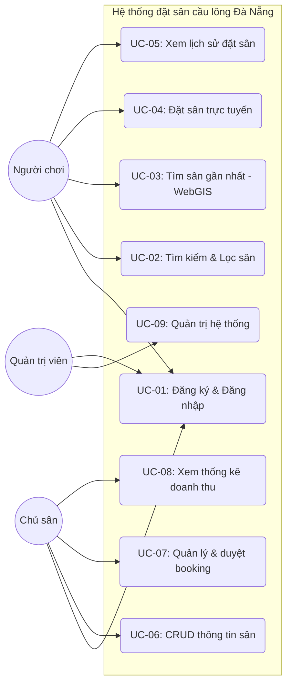
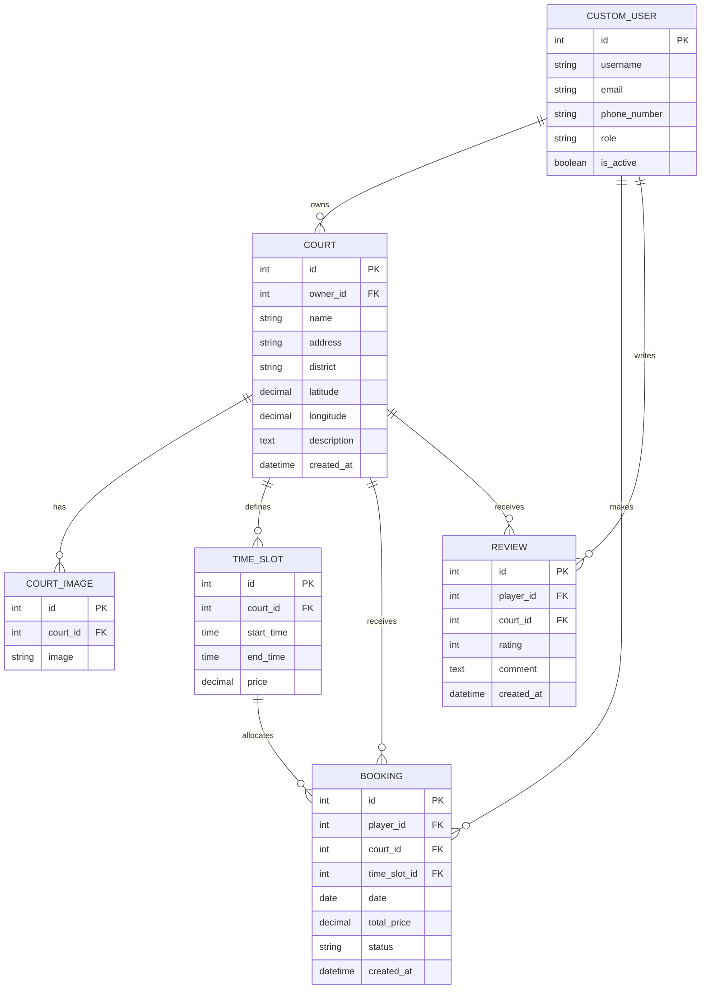
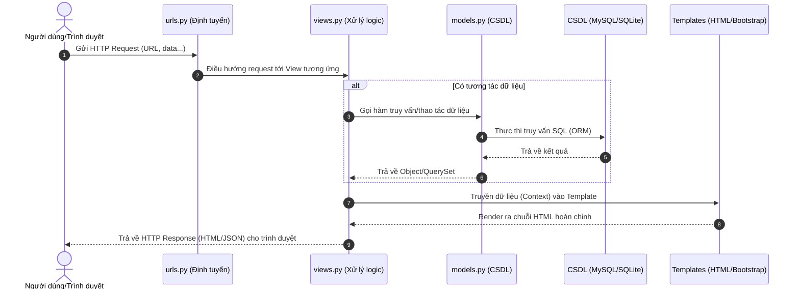
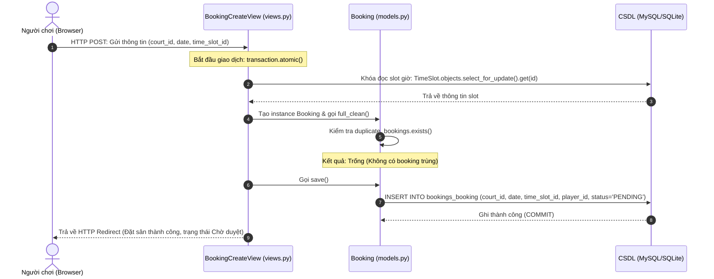
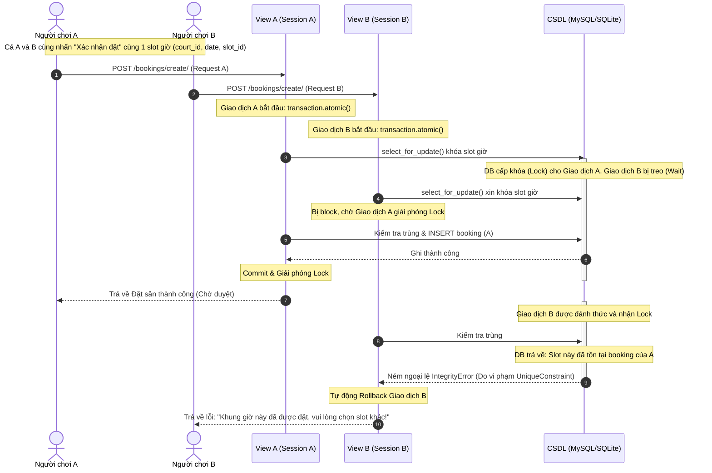
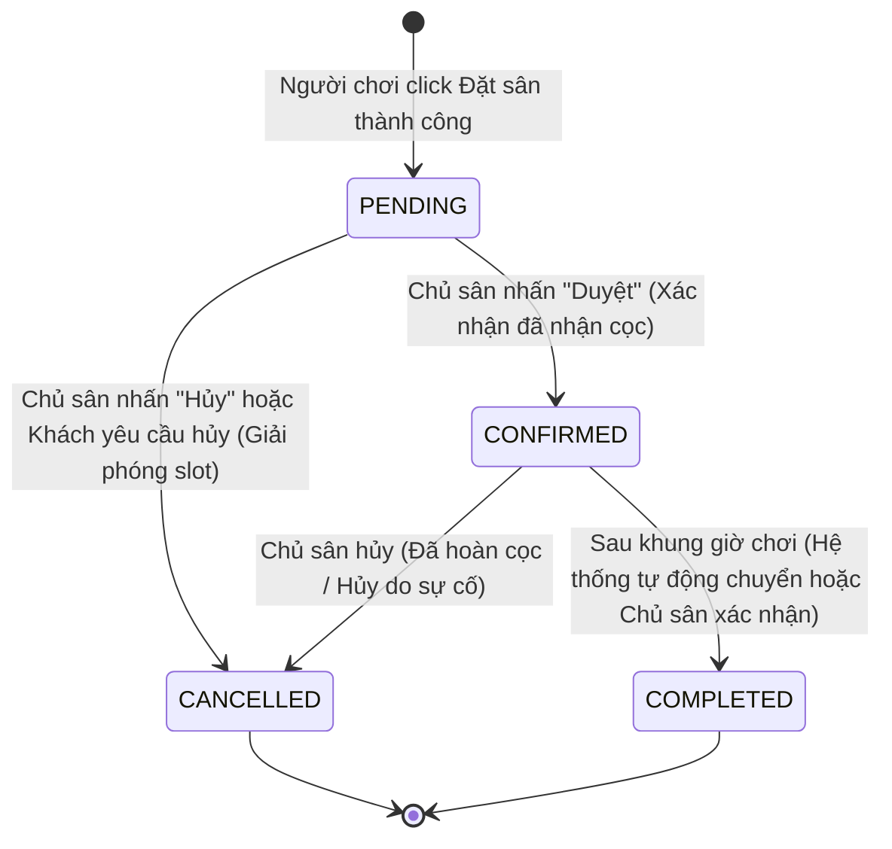

# CHƯƠNG 3: PHÂN TÍCH VÀ THIẾT KẾ HỆ THỐNG

## 3.1 Yêu cầu chức năng và phi chức năng của hệ thống
Hệ thống đặt sân cầu lông Đà Nẵng được phân tích và đặc tả chi tiết thành 12 yêu cầu chức năng (được phân chia ưu tiên theo khung MoSCoW) và 5 yêu cầu phi chức năng phục vụ vận hành.

### 3.1.1 Yêu cầu chức năng (FR)
Các yêu cầu chức năng được mô tả cụ thể trong Bảng 3.1.

**Bảng 3.1: Danh sách các yêu cầu chức năng của hệ thống**

| Mã yêu cầu | Tên yêu cầu chức năng | Tác nhân | Mức ưu tiên (MoSCoW) | Mô tả chi tiết (Kiểm thử được) |
|---|---|---|---|---|
| **FR-01** | Đăng ký & Đăng nhập | Người chơi, Chủ sân | **Must** | Cho phép người dùng đăng ký tài khoản mới bằng cách nhập Họ tên, SĐT, Email, Mật khẩu và vai trò (Người chơi/Chủ sân). Xác thực đăng nhập bằng Email và Mật khẩu. |
| **FR-02** | Phân quyền vai trò | Người chơi, Chủ sân, Admin | **Must** | Người chơi chỉ được tìm/đặt sân và xem lịch sử đặt của mình. Chủ sân chỉ được CRUD sân của mình, duyệt/hủy booking thuộc sân của mình, và xem thống kê. Admin có toàn quyền quản trị qua Django Admin. |
| **FR-03** | CRUD thông tin sân | Chủ sân | **Must** | Chủ sân có thể thêm mới, cập nhật, xóa thông tin sân của mình gồm: Tên sân, Địa chỉ, Quận, Giá thuê theo giờ, Tọa độ Lat/Lng, Hình ảnh (giới hạn dung lượng <5MB). |
| **FR-04** | Bản đồ WebGIS hiển thị sân | Người chơi | **Must** | Giao diện trang chủ hiển thị bản đồ Leaflet + OSM. Bản đồ tự động đánh dấu các marker đại diện cho các sân cầu lông trong CSDL, khi click vào marker hiển thị popup thông tin chi tiết. |
| **FR-05** | Tìm kiếm & Lọc sân | Người chơi | **Must** | Cho phép lọc danh sách sân hiển thị theo Quận, Khoảng giá, Ngày chơi và các khung giờ còn trống (time slot). |
| **FR-06** | Định vị & Tìm sân gần nhất | Người chơi | **Must** | Cho phép người dùng bật định vị Geolocation, hệ thống áp dụng công thức Haversine để tính khoảng cách và tự động highlight, zoom cận cảnh marker của sân gần nhất. |
| **FR-07** | Đặt sân trực tuyến | Người chơi | **Must** | Người chơi chọn một sân -> chọn ngày -> hiện các khung giờ (slot) -> click chọn slot trống -> nhấn đặt sân -> tạo booking ở trạng thái "Chờ duyệt". |
| **FR-08** | Chống trùng lịch đặt | Hệ thống | **Must** | Đảm bảo một slot đặt sân (sân, ngày, khung giờ) chỉ có thể được đặt bởi duy nhất 1 người chơi. Áp dụng ràng buộc unique và transaction ở mức CSDL để chống trùng lịch khi 2 người nhấn đặt đồng thời. |
| **FR-09** | Dashboard & Quản lý booking | Chủ sân | **Must** | Chủ sân xem danh sách các booking đặt sân của mình ở dạng bảng biểu trực quan. Hỗ trợ nút thao tác nhanh: Xác nhận duyệt đặt sân (đã nhận cọc) hoặc Hủy đặt sân (tự động giải phóng slot). |
| **FR-10** | Lịch sử đặt sân | Người chơi | **Must** | Người chơi xem danh sách các sân mình đã đặt, thời gian đặt, tổng tiền và trạng thái hiện tại (Chờ duyệt / Đã cọc / Đã hủy). |
| **FR-11** | Thống kê doanh thu | Chủ sân | **Should** | Hiển thị biểu đồ/bảng thống kê số lượt đặt sân thành công và doanh thu ước tính theo tuần/tháng cho chủ sân. |
| **FR-12** | Đánh giá rating đơn giản | Người chơi | **Could** | Cho phép người chơi đánh giá từ 1 đến 5 sao cho sân cầu lông sau khi trạng thái đặt sân được chủ sân xác nhận hoàn thành. |

### 3.1.2 Yêu cầu phi chức năng (NFR)
Các yêu cầu phi chức năng và phương pháp kiểm chứng được mô tả tại Bảng 3.2.

**Bảng 3.2: Danh sách các yêu cầu phi chức năng của hệ thống**

| Mã yêu cầu | Phân loại | Mô tả chi tiết (Đo lường được) | Phương pháp kiểm chứng |
|---|---|---|---|
| **NFR-01** | Hiệu năng (Performance) | Thời gian phản hồi của trang danh sách sân và tải bản đồ WebGIS không vượt quá 2.0 giây dưới điều kiện băng thông thông thường. | Kiểm tra qua công cụ Lighthouse hoặc Network Tab trong Chrome Developer Tools. |
| **NFR-02** | Bảo mật (Security) | Mật khẩu người dùng lưu trữ trong CSDL được băm bằng thuật toán an toàn (PBKDF2 mặc định của Django). Chống SQL Injection, XSS và CSRF qua ORM và Middleware mặc định của Django. | Kiểm thử rà soát mã nguồn và kiểm tra cơ chế CSRF token trên các form POST. |
| **NFR-03** | Khả dụng (Usability) | Giao diện hệ thống tương thích tốt với các thiết bị di động (tối thiểu màn hình rộng 360px) và màn hình máy tính nhờ sử dụng Responsive Web Design (Bootstrap 5). | Kiểm tra hiển thị responsive bằng công cụ Toggle Device Toolbar của trình duyệt. |
| **NFR-04** | Tuân thủ Pháp lý (Legal) | Tuân thủ Nghị định 13/2023/NĐ-CP: chỉ thu thập thông tin SĐT, Email tối thiểu, hiển thị thông báo thu thập và có nút xóa tài khoản. Bản đồ hiển thị đầy đủ attribution OpenStreetMap theo giấy phép ODbL. | Kiểm thử thực tế ca sử dụng xóa tài khoản và rà soát giao diện bản đồ hiển thị attribution. |
| **NFR-05** | Tương thích (Compatibility) | Website hoạt động ổn định và hiển thị thống nhất trên các trình duyệt phổ biến hiện nay: Google Chrome, Apple Safari, Mozilla Firefox và Microsoft Edge. | Kiểm thử chạy ứng dụng trên các trình duyệt khác nhau. |

---

## 3.2 Biểu đồ use-case và đặc tả ca sử dụng chi tiết
Để mô tả rõ ràng các mối tương tác của các tác nhân (Người chơi, Chủ sân, Admin) đối với các chức năng của hệ thống, sơ đồ Use-case tổng thể được thiết lập như Hình 3.1.

### 3.2.1 Sơ đồ Use-case tổng thể

*(Hình 3.1: Sơ đồ Use-case tổng thể hệ thống)*

### 3.2.2 Đặc tả 5 Use-case cốt lõi

#### 1. Đặc tả UC-04: Đặt sân trực tuyến (Phục vụ FR-07, FR-08)
- **Tên use-case**: UC-04: Đặt sân trực tuyến.
- **Tác nhân chính**: Người chơi.
- **Tiền điều kiện**: Người chơi đã đăng nhập thành công vào tài khoản của mình.
- **Luồng chính (Main flow)**:
  1. Người chơi truy cập trang chi tiết của một sân cầu lông cụ thể.
  2. Hệ thống hiển thị lịch chọn ngày và danh sách các khung giờ (slot) tương ứng với ngày hiện tại.
  3. Người chơi chọn ngày chơi mong muốn.
  4. Hệ thống tải lại danh sách các slot giờ của ngày đã chọn cùng trạng thái (Trống/Chờ duyệt/Đã cọc).
  5. Người chơi click chọn một slot trống và nhấn nút "Đặt sân".
  6. Hệ thống hiển thị biểu mẫu xác nhận thông tin đặt sân (Sân, ngày, giờ, tổng tiền, thông tin thanh toán cọc).
  7. Người chơi kiểm tra thông tin và nhấn "Xác nhận đặt sân".
  8. Hệ thống lưu booking vào CSDL ở trạng thái "Chờ duyệt", đồng thời khóa tạm thời slot giờ đó (chuyển sang trạng thái Chờ duyệt) để tránh trùng lịch.
- **Luồng ngoại lệ (Alternative/Exception flow)**:
  - *Trường hợp trùng lịch (Double-booking)*: Tại bước 7, nếu một người chơi khác đã nhấn xác nhận đặt slot này trước và ghi thành công vào CSDL. Hệ thống kiểm tra trùng lặp -> hiển thị thông báo lỗi: "Khung giờ này vừa có người đặt trước, vui lòng chọn khung giờ khác", đồng thời hủy giao dịch hiện tại (rollback) và đưa người dùng quay lại bước 4.

#### 2. Đặc tả UC-06: CRUD thông tin sân (Phục vụ FR-03)
- **Tên use-case**: UC-06: CRUD thông tin sân.
- **Tác nhân chính**: Chủ sân.
- **Tiền điều kiện**: Chủ sân đã đăng nhập bằng tài khoản có quyền "Chủ sân".
- **Luồng chính (Main flow - Thêm sân mới)**:
  1. Chủ sân truy cập Dashboard chủ sân và chọn "Thêm sân mới".
  2. Hệ thống hiển thị biểu mẫu nhập thông tin sân: Tên sân, Địa chỉ, Quận, Giá thuê theo giờ, Tọa độ Lat/Lng, Tải ảnh lên.
  3. Chủ sân điền đầy đủ các thông tin và click chọn vị trí trực quan trên bản đồ nhỏ đi kèm để hệ thống tự động điền tọa độ Lat/Lng.
  4. Chủ sân nhấn nút "Lưu".
  5. Hệ thống kiểm tra tính hợp lệ của dữ liệu (dung lượng ảnh <5MB, tọa độ nằm trong Đà Nẵng, các trường bắt buộc không để trống).
  6. Hệ thống lưu dữ liệu sân mới vào CSDL, liên kết với tài khoản chủ sân và hiển thị thông báo thành công.
- **Luồng ngoại lệ (Alternative/Exception flow)**:
  - *Dữ liệu không hợp lệ*: Tại bước 5, nếu dữ liệu thiếu hoặc ảnh quá dung lượng -> Hệ thống hiển thị cảnh báo lỗi cụ thể bên cạnh trường dữ liệu lỗi, giữ lại các thông tin hợp lệ đã điền để chủ sân sửa đổi.

#### 3. Đặc tả UC-07: Quản lý & duyệt booking (Phục vụ FR-09)
- **Tên use-case**: UC-07: Quản lý & duyệt booking.
- **Tác nhân chính**: Chủ sân.
- **Tiền điều kiện**: Chủ sân đã đăng nhập và có yêu cầu đặt sân đang ở trạng thái "Chờ duyệt".
- **Luồng chính (Duyệt booking khi nhận cọc)**:
  1. Chủ sân truy cập mục "Quản lý Đặt sân" trên Dashboard.
  2. Hệ thống hiển thị bảng danh sách các booking gồm: Tên khách hàng, SĐT, Ngày đặt, Khung giờ, Số tiền cọc, Trạng thái (Chờ duyệt).
  3. Chủ sân kiểm tra thông tin giao dịch ngân hàng của mình để xác nhận đã nhận cọc.
  4. Chủ sân nhấn nút "Xác nhận duyệt" tại dòng booking tương ứng.
  5. Hệ thống cập nhật trạng thái booking thành "Đã cọc" (Thành công) trong CSDL, đồng thời cập nhật lịch sử cho người chơi.
- **Luồng ngoại lệ (Alternative/Exception flow)**:
  - *Khách hủy đặt hoặc không chuyển cọc đúng hạn*: Tại bước 3, nếu khách yêu cầu hủy hoặc quá thời gian giữ sân mà chưa nhận được tiền cọc, chủ sân nhấn nút "Hủy booking". Hệ thống cập nhật trạng thái thành "Đã hủy" trong CSDL và tự động giải phóng slot giờ này trở lại trạng thái "Trống" cho mọi người tìm kiếm.

#### 4. Đặc tả UC-02: Tìm kiếm & Lọc sân (Phục vụ FR-04, FR-05, FR-06)
- **Tên use-case**: UC-02: Tìm kiếm & Lọc sân.
- **Tác nhân chính**: Người chơi.
- **Tiền điều kiện**: Không yêu cầu đăng nhập.
- **Luồng chính (Tìm kiếm và lọc)**:
  1. Người chơi truy cập vào trang chủ.
  2. Hệ thống tải bản đồ WebGIS hiển thị toàn bộ marker của các sân cầu lông tại Đà Nẵng và thanh công cụ lọc.
  3. Người chơi chọn các tiêu chí: Quận (Hải Châu, Cẩm Lệ...), khoảng giá, ngày chơi và khung giờ trống.
  4. Người chơi nhấn nút "Lọc sân".
  5. Hệ thống truy vấn CSDL và lọc ra các sân thỏa mãn tiêu chí.
  6. Bản đồ cập nhật hiển thị các marker thỏa mãn và danh sách sidebar tương ứng.
- **Luồng ngoại lệ (Alternative/Exception flow)**:
  - *Không tìm thấy kết quả phù hợp*: Tại bước 5, nếu không có sân nào khớp bộ lọc -> Hệ thống hiển thị thông báo: "Không tìm thấy sân nào phù hợp với điều kiện của bạn, vui lòng mở rộng bộ lọc" trên sidebar và không thay đổi hiển thị các marker cũ trên bản đồ.

#### 5. Đặc tả UC-09: Quản trị hệ thống (Phục vụ FR-02)
- **Tên use-case**: UC-09: Quản trị hệ thống.
- **Tác nhân chính**: Quản trị viên (Admin).
- **Tiền điều kiện**: Admin đăng nhập thành công vào đường dẫn trang quản trị Django Admin (`/admin/`).
- **Luồng chính (Duyệt tài khoản chủ sân mới đăng ký)**:
  1. Admin đăng nhập vào trang quản trị Django Admin.
  2. Hệ thống hiển thị trang quản trị phân hệ các bảng dữ liệu trong CSDL.
  3. Admin click vào danh sách "Chủ sân chưa kích hoạt".
  4. Admin kiểm tra các thông tin pháp lý/đăng ký của chủ sân.
  5. Admin chọn "Duyệt kích hoạt" và nhấn "Lưu".
  6. Hệ thống cập nhật quyền hoạt động của chủ sân trong CSDL, cho phép chủ sân đăng nhập và bắt đầu đăng ký sân.
- **Luồng ngoại lệ (Alternative/Exception flow)**:
  - *Từ chối kích hoạt*: Tại bước 4, nếu phát hiện thông tin giả mạo, Admin chọn "Xóa tài khoản" hoặc "Khóa vĩnh viễn". Hệ thống xóa/khóa tài khoản tương ứng trong CSDL và gửi email thông báo từ chối.

---

## 3.3 Thiết kế cơ sở dữ liệu và sơ đồ ERD
Cơ sở dữ liệu của hệ thống được xây dựng xung quanh 6 thực thể chính. Sơ đồ quan hệ thực thể (ERD) được thể hiện tại Hình 3.2.

### 3.3.1 Sơ đồ ERD hệ thống

*(Hình 3.2: Sơ đồ quan hệ thực thể ERD)*

### 3.3.2 Đặc tả chi tiết các thực thể (Models)

#### 1. Thực thể CustomUser (App: `accounts`)
* Kế thừa từ `AbstractUser` mặc định của Django để quản lý tài khoản người dùng và xác thực.
* Các trường định nghĩa:
  - `id`: `AutoField(primary_key=True)` -> Khóa chính.
  - `username`: `CharField(max_length=150, unique=True)` -> Tên tài khoản.
  - `email`: `EmailField(unique=True)` -> Email đăng nhập.
  - `phone_number`: `CharField(max_length=15, blank=False, null=False)` -> Số điện thoại (Tuân thủ Nghị định 13/2023/NĐ-CP).
  - `role`: `CharField(max_length=10, choices=[('PLAYER', 'Player'), ('OWNER', 'Court Owner'), ('ADMIN', 'Admin')], default='PLAYER')` -> Phân quyền vai trò người dùng.
  - `is_active`: `BooleanField(default=True)` -> Trạng thái kích hoạt.

#### 2. Thực thể Court (App: `courts`)
* Lưu trữ thông tin chi tiết về sân cầu lông.
* Các trường định nghĩa:
  - `id`: `AutoField(primary_key=True)` -> Khóa chính.
  - `owner`: `ForeignKey(CustomUser, on_delete=models.CASCADE, related_name='courts')` -> Liên kết 1-N đến chủ sở hữu sân.
  - `name`: `CharField(max_length=255)` -> Tên cụm sân cầu lông.
  - `address`: `CharField(max_length=255)` -> Địa chỉ.
  - `district`: `CharField(max_length=50)` -> Quận thuộc Đà Nẵng (phục vụ bộ lọc).
  - `latitude`: `DecimalField(max_digits=9, decimal_places=6)` -> Vĩ độ tọa độ (phục vụ hiển thị WebGIS Leaflet - KHÔNG dùng GeoDjango).
  - `longitude`: `DecimalField(max_digits=9, decimal_places=6)` -> Kinh độ tọa độ.
  - `description`: `TextField(blank=True)` -> Mô tả chi tiết sân.
  - `created_at`: `DateTimeField(auto_now_add=True)` -> Thời gian đăng ký.

#### 3. Thực thể CourtImage (App: `courts`)
* Lưu trữ các hình ảnh liên kết với sân cầu lông (1 sân có nhiều ảnh).
* Các trường định nghĩa:
  - `id`: `AutoField(primary_key=True)` -> Khóa chính.
  - `court`: `ForeignKey(Court, on_delete=models.CASCADE, related_name='images')` -> Khóa ngoại liên kết sân.
  - `image`: `ImageField(upload_to='court_images/')` -> Đường dẫn tải ảnh lên.

#### 4. Thực thể TimeSlot (App: `courts`)
* Thiết lập các khung giờ mẫu và bảng giá cố định cho sân cầu lông.
* Các trường định nghĩa:
  - `id`: `AutoField(primary_key=True)` -> Khóa chính.
  - `court`: `ForeignKey(Court, on_delete=models.CASCADE, related_name='slots')` -> Khóa ngoại liên kết sân.
  - `start_time`: `TimeField()` -> Thời gian bắt đầu slot.
  - `end_time`: `TimeField()` -> Thời gian kết thúc slot.
  - `price`: `DecimalField(max_digits=10, decimal_places=2)` -> Giá thuê của slot.

#### 5. Thực thể Booking (App: `bookings`)
* Lưu trữ lịch sử đặt sân của người chơi.
* Các trường định nghĩa:
  - `id`: `AutoField(primary_key=True)` -> Khóa chính.
  - `player`: `ForeignKey(CustomUser, on_delete=models.CASCADE, related_name='bookings')` -> Người chơi đặt sân.
  - `court`: `ForeignKey(Court, on_delete=models.CASCADE, related_name='bookings')` -> Sân được đặt.
  - `time_slot`: `ForeignKey(TimeSlot, on_delete=models.CASCADE, related_name='bookings')` -> Khung giờ đặt.
  - `date`: `DateField()` -> Ngày đặt chơi cầu lông.
  - `total_price`: `DecimalField(max_digits=10, decimal_places=2)` -> Tổng giá trị booking.
  - `status`: `CharField(max_length=15, choices=[('PENDING', 'Pending'), ('CONFIRMED', 'Confirmed'), ('CANCELLED', 'Cancelled')], default='PENDING')` -> Trạng thái booking (Chờ duyệt / Đã cọc / Đã hủy).
  - `created_at`: `DateTimeField(auto_now_add=True)` -> Ngày giờ tạo giao dịch đặt sân.
* **Cơ chế chống trùng lịch (Double-booking Constraint)**:
  - Áp dụng cấu hình `UniqueConstraint(fields=['court', 'date', 'time_slot'], name='unique_court_booking_slot')` trong class Meta của Model `Booking`.
  - Cơ chế hoạt động: Ràng buộc này tạo ra một khóa chỉ mục unique tổng hợp ở mức CSDL MySQL/SQLite. Khi có giao dịch ghi trùng lặp đồng thời (cùng ID sân, cùng ngày, cùng khung giờ), CSDL sẽ chặn giao dịch và quăng ngoại lệ `IntegrityError`. Ứng dụng sẽ bắt ngoại lệ này để thực hiện rollback transaction, đảm bảo không thể xảy ra hiện tượng đặt trùng sân (double-booking).

#### 6. Thực thể Review (App: `courts`)
* Lưu trữ đánh giá của người chơi về sân (1 sân có nhiều review).
* Các trường định nghĩa:
  - `id`: `AutoField(primary_key=True)` -> Khóa chính.
  - `player`: `ForeignKey(CustomUser, on_delete=models.CASCADE, related_name='reviews')` -> Người chơi đánh giá.
  - `court`: `ForeignKey(Court, on_delete=models.CASCADE, related_name='reviews')` -> Sân được đánh giá.
  - `rating`: `IntegerField()` -> Điểm số đánh giá từ 1 đến 5.
  - `comment`: `TextField(blank=True)` -> Nhận xét.
  - `created_at`: `DateTimeField(auto_now_add=True)` -> Thời gian đánh giá.

---

## 3.4 Sơ đồ tuần tự luồng Request/Response MVT & Định tuyến

### 3.4.1 Luồng xử lý Request/Response tổng thể
Luồng đi của một request từ người dùng đến khi nhận được response hiển thị trên trình duyệt được mô phỏng tại Hình 3.3.


*(Hình 3.3: Sơ đồ tuần tự xử lý Request/Response MVT)*

### 3.4.2 Phân định trách nhiệm của 3 app Django
- **accounts**: Quản lý CustomUser, thiết lập form đăng ký (cho cả Player và CourtOwner), đăng nhập, đăng xuất, phân quyền ở mức view (sử dụng decorator `login_required`, mixin `LoginRequiredMixin` và decorator/mixin kiểm tra role tùy biến để phân luồng truy cập).
- **courts**: Đăng ký thông tin sân cầu lông, upload và hiển thị hình ảnh sân (`CourtImage`), CRUD các khung giờ mẫu (`TimeSlot`), tạo API JSON `/api/courts/` cho bản đồ Leaflet.
- **bookings**: Quản lý quy trình đặt sân, lưu thông tin đặt sân (`Booking`), trang danh sách lịch sử đặt sân của người chơi, Dashboard quản trị duyệt/hủy cọc của chủ sân, thực thi logic chống trùng lịch (double-booking) tại tầng Model kết hợp transaction.

### 3.4.3 Bảng định tuyến URL - View - Template - Phân quyền
Bảng 3.3 liệt kê toàn bộ các routing chính của hệ thống phục vụ các chức năng cốt lõi (Must).

**Bảng 3.3: Bảng định tuyến URL hệ thống**

| App | Chức năng (Must) | URL Pattern | View Class/Function | Template file | Phân quyền truy cập |
|---|---|---|---|---|---|
| **accounts** | Đăng ký tài khoản | `/accounts/register/` | `UserRegisterView` (CBV) | `accounts/register.html` | Công khai |
| **accounts** | Đăng nhập | `/accounts/login/` | `UserLoginView` (CBV) | `accounts/login.html` | Công khai |
| **accounts** | Đăng xuất | `/accounts/logout/` | `UserLogoutView` (CBV) | - (Redirect to login) | Đã đăng nhập |
| **courts** | Trang chủ & Bản đồ WebGIS | `/` | `CourtMapView` (CBV) | `courts/map.html` | Công khai |
| **courts** | API JSON danh sách sân | `/api/courts/` | `court_api_list` (FBV) | - (Trả về JSON) | Công khai |
| **courts** | Chi tiết sân cầu lông | `/courts/<int:pk>/` | `CourtDetailView` (CBV) | `courts/court_detail.html` | Công khai |
| **courts** | Dashboard chủ sân: CRUD Sân | `/courts/manage/` | `CourtManageListView` (CBV) | `courts/manage_list.html` | Chủ sân (Owner) |
| **courts** | Dashboard chủ sân: Thêm sân | `/courts/manage/add/` | `CourtCreateView` (CBV) | `courts/court_form.html` | Chủ sân (Owner) |
| **courts** | Dashboard chủ sân: Sửa sân | `/courts/manage/<int:pk>/edit/` | `CourtUpdateView` (CBV) | `courts/court_form.html` | Chủ sân (Owner) |
| **courts** | Dashboard chủ sân: Xóa sân | `/courts/manage/<int:pk>/delete/` | `CourtDeleteView` (CBV) | `courts/court_confirm_delete.html` | Chủ sân (Owner) |
| **bookings** | Tạo đặt sân trực tuyến | `/bookings/create/<int:court_id>/` | `BookingCreateView` (CBV) | `bookings/booking_form.html` | Người chơi (Player) |
| **bookings** | Lịch sử đặt sân (Người chơi) | `/bookings/history/` | `PlayerBookingHistoryView` (CBV) | `bookings/player_history.html` | Người chơi (Player) |
| **bookings** | Dashboard chủ sân: QL Đặt sân | `/bookings/manage/` | `OwnerBookingListView` (CBV) | `bookings/owner_booking_list.html` | Chủ sân (Owner) |
| **bookings** | Dashboard chủ sân: Duyệt booking | `/bookings/manage/<int:pk>/approve/` | `approve_booking` (FBV POST) | - (Redirect to Dashboard) | Chủ sân (Owner) |
| **bookings** | Dashboard chủ sân: Hủy booking | `/bookings/manage/<int:pk>/cancel/` | `cancel_booking` (FBV POST) | - (Redirect to Dashboard) | Chủ sân (Owner) |

---

## 3.5 Thiết kế giao diện và Wireframe các màn hình cốt lõi
Giao diện người dùng được thiết kế dựa trên nguyên tắc mobile-first và tính khả dụng cao.

### 3.5.1 Bố cục giao diện (ASCII Wireframe)
Sơ đồ khối bố cục các màn hình chính được thể hiện lần lượt:

#### Màn hình 1 & 2: Trang chủ + Bản đồ WebGIS & Bộ lọc
```text
+-----------------------------------------------------------------------------------+
|  [Logo] SÂN CẦU LÔNG ĐÀ NẴNG                     Đăng ký | Đăng nhập | Đăng xuất   |
+-----------------------------------------------------------------------------------+
|  LỌC SÂN CẦU LÔNG                               |                                 |
|  Quận:    [ Tất cả quận      v ]                |          BẢN ĐỒ WEBGIS          |
|  Giá max: [ 80.000 đ/giờ     v ]                |                                 |
|  Giờ:     [ 17h00 - 18h00    v ]                |       +-----------------+       |
|  Ngày:    [ dd/mm/yyyy         ]                |       | [Marker]        |       |
|                                                 |       | Sân BetaEra     |       |
|  [ NÚT ĐỊNH VỊ GẦN NHẤT ]                       |       | Giá: 100k       |       |
|                                                 |       | [ĐẶT SÂN NGAY]  |       |
|  DANH SÁCH SÂN THỎA MÃN                         |       +-----------------+       |
|  ------------------------------                 |                                 |
|  1. Sân cầu lông BetaEra                        |                                 |
|     273 Nguyễn Tri Phương, Hải Châu             |                                 |
|     Giá: 70.000 - 100.000 đ/giờ                 |                                 |
|     [CHI TIẾT]   [ĐẶT SÂN]                      |                                 |
+-----------------------------------------------------------------------------------+
```

#### Màn hình 3: Chi tiết sân cầu lông
```text
+-----------------------------------------------------------------------------------+
|  [Logo] SÂN CẦU LÔNG ĐÀ NẴNG                                           Trang chủ  |
+-----------------------------------------------------------------------------------+
|  SÂN CẦU LÔNG BETAERA                                                             |
|  Địa chỉ: 273–275 Nguyễn Tri Phương, Hải Châu, Đà Nẵng                            |
|  [Ảnh đại diện sân]                                                               |
|  Mô tả: Sân thảm gỗ cao cấp, thảm thi đấu chuẩn quốc tế...                        |
|  CHỌN NGÀY CHƠI: [ dd/mm/yyyy ]                                                   |
|  CÁC KHUNG GIỜ:                                                                   |
|  +---------------------+---------------------+---------------------+              |
|  |   17h00 - 18h00     |   18h00 - 19h00     |   19h00 - 20h00     |              |
|  |     Giá: 100k       |      Giá: 100k      |      Giá: 100k      |              |
|  |    [ ĐẶT SÂN ]      |   [ CHỜ DUYỆT ]     |     [ ĐÃ ĐẶT ]      |              |
|  +---------------------+---------------------+---------------------+              |
+-----------------------------------------------------------------------------------+
```

#### Màn hình 4: Form đặt sân trực tuyến
```text
+-----------------------------------------------------------------------------------+
|  [Logo] SÂN CẦU LÔNG ĐÀ NẴNG                                           Trang chủ  |
+-----------------------------------------------------------------------------------+
|  XÁC NHẬN THÔNG TIN ĐẶT SÂN                                                       |
|  Tên sân:      Sân cầu lông BetaEra                                               |
|  Ngày chơi:    03/07/2026    |  Khung giờ: 17h00 - 18h00                          |
|  Tổng thanh toán (cọc 100%): 100.000 đ                                            |
|  HƯỚNG DẪN CHUYỂN KHOẢN CỌC                                                       |
|  Vietinbank - STK: 101872658933 - Nội dung: [CK COCT24070301]                     |
|  [ HỦY BỎ ]          [ XÁC NHẬN ĐẶT SÂN ]                                         |
+-----------------------------------------------------------------------------------+
```

### 3.5.2 Đặc tả thành phần UI và Model dữ liệu truy vết
Chi tiết các thành phần UI, hành động người dùng và liên kết Model dữ liệu của 6 màn hình chính được thống kê tại Bảng 3.4.

**Bảng 3.4: Bảng đặc tả giao diện hệ thống**

| Màn hình | Thành phần UI chính | Hành động người dùng | Ánh xạ FR/UC | Dữ liệu Model |
|---|---|---|---|---|
| **1 & 2. Trang chủ & Bản đồ & Lọc** | Bản đồ Leaflet, Marker, Form lọc (Quận, Giá, Giờ, Ngày), Nút định vị. | Click marker hiện popup, thay đổi bộ lọc nhấn Tìm kiếm, nhấn Định vị. | FR-04, FR-05, FR-06 / UC-02, UC-03 | `Court` (tên, địa chỉ, lat, lng, quận), `TimeSlot` (giá). |
| **3. Chi tiết sân** | Ảnh sân, Text mô tả, Input Date picker, Danh sách slot giờ động. | Chọn ngày chơi khác, click slot giờ trống để đặt sân, xem reviews. | FR-03, FR-07, FR-12 / UC-04 | `Court` (mô tả, ảnh), `TimeSlot` (khung giờ, giá), `Booking` (status để khóa slot), `Review`. |
| **4. Form đặt sân** | Bảng tóm tắt thông tin đặt sân, text hướng dẫn chuyển khoản, nút xác nhận. | Nhấn xác nhận đặt sân, nhấn hủy quay lại. | FR-07, FR-08 / UC-04 | Lưu thông tin đặt vào `Booking`. |
| **5. Dashboard chủ sân** | Menu chức năng, Bảng danh sách booking chờ duyệt và lịch sử đặt sân. | Click Duyệt (đã cọc) hoặc Hủy (hủy slot giờ). | FR-09 / UC-07 | `Booking` (lọc theo các sân của Owner), `CustomUser` (thông tin khách). |
| **6. Django Admin** | Dashboard quản trị các thực thể CSDL. | Admin CRUD dữ liệu, duyệt chủ sân mới, khóa tài khoản vi phạm. | FR-02 / UC-09 | Toàn bộ các bảng trong DB. |

---

## 3.6 Sơ đồ tuần tự luồng đặt sân chi tiết và kịch bản đồng thời
Phần cốt lõi thiết kế để giải quyết vấn đề chống trùng lịch (double-booking) được chi tiết hóa thành các sơ đồ tuần tự dưới đây.

### 3.6.1 Sơ đồ tuần tự Đặt sân trường hợp bình thường
Hình 3.4 mô tả tiến trình đăng ký thuê sân thuận lợi của một người dùng.


*(Hình 3.4: Sơ đồ sequence đặt lịch sân bình thường)*

### 3.6.2 Sơ đồ tuần tự Đặt sân trường hợp đồng thời (Tranh chấp Lock)
Hình 3.5 mô tả tiến trình xử lý tranh chấp khi Người chơi A và Người chơi B nhấn đặt cùng 1 slot giờ của 1 sân cùng 1 thời điểm.


*(Hình 3.5: Sơ đồ sequence tranh chấp đồng thời)*

---

## 3.7 Sơ đồ trạng thái Booking
Vòng đời trạng thái của tệp dữ liệu Booking được mô tả thông qua sơ đồ trạng thái (Hình 3.6).


*(Hình 3.6: Sơ đồ trạng thái Booking)*
