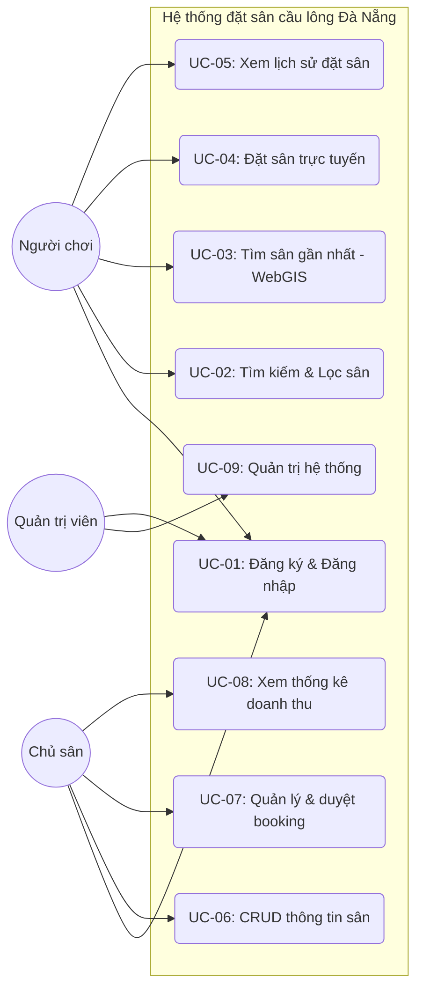
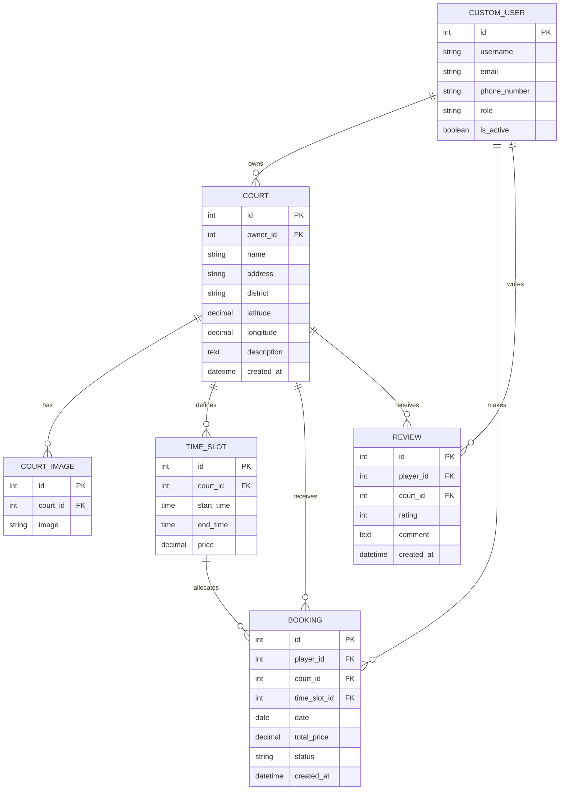
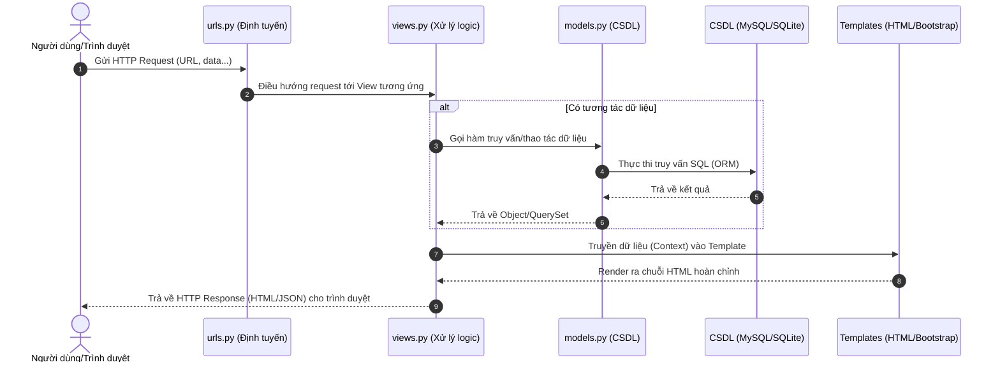
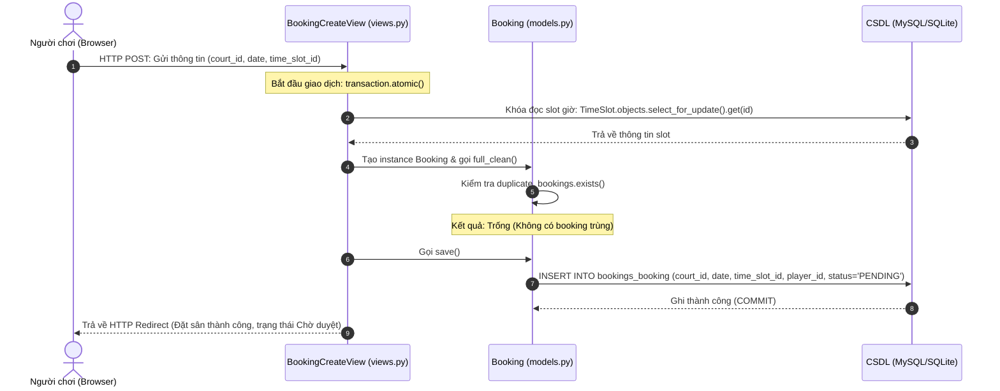
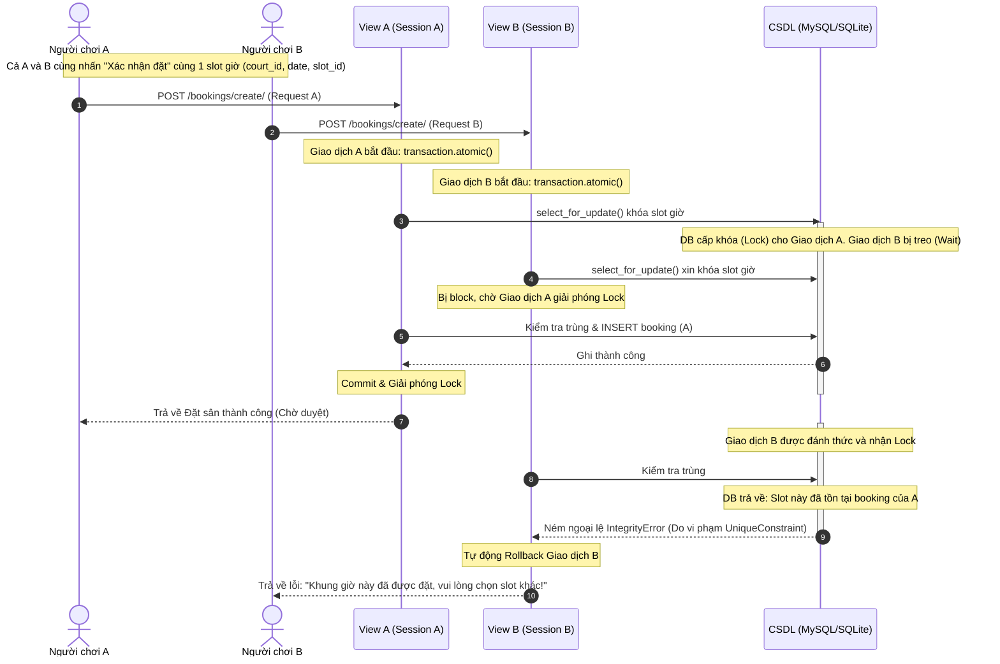
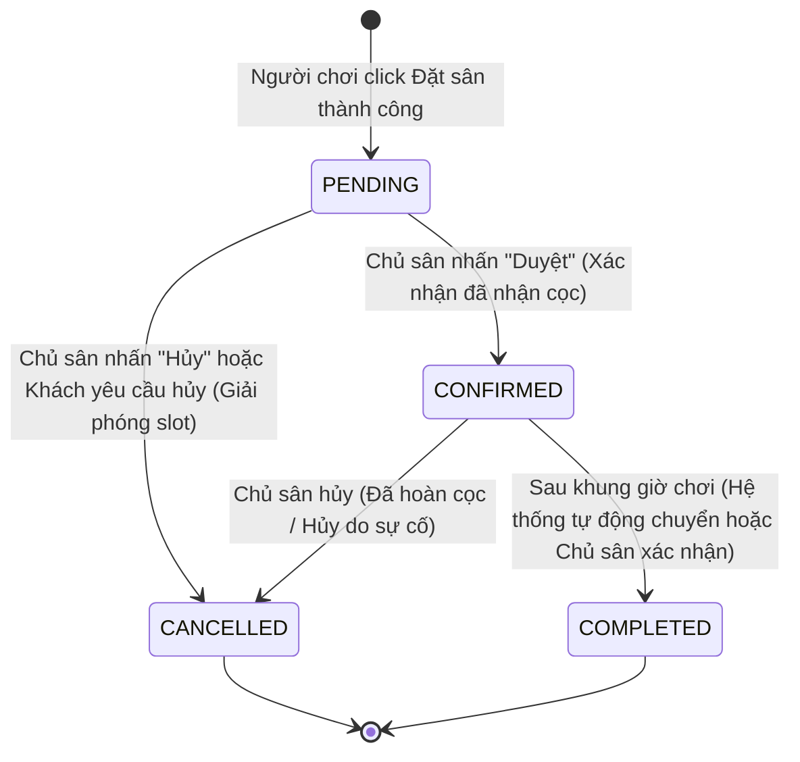

# BỘ GIÁO DỤC VÀ ĐÀO TẠO
# TRƯỜNG ĐẠI HỌC DUY TÂN
# KHOA CÔNG NGHỆ THÔNG TIN

---

# BÁO CÁO ĐỒ ÁN TỐT NGHIỆP CỬ NHÂN CÔNG NGHỆ THÔNG TIN
## CHUYÊN NGÀNH: CÔNG NGHỆ PHẦN MỀM

### ĐỀ TÀI:
**XÂY DỰNG WEBSITE CHO THUÊ VÀ QUẢN LÝ ĐẶT SÂN CẦU LÔNG TÍCH HỢP BẢN ĐỒ SỐ WEBGIS TẠI THÀNH PHỐ ĐÀ NẴNG**

- **Giảng viên hướng dẫn:** ThS. Nguyễn Trung Thuận
- **Sinh viên thực hiện:** Đào Thị Phương (Mã SV: 9981)
- **Năm bảo vệ:** 2026

---

## LỜI CAM ĐOAN

Tôi xin cam đoan đây là công trình nghiên cứu và phát triển hệ thống độc lập của tôi dưới sự hướng dẫn khoa học của ThS. Nguyễn Trung Thuận. Toàn bộ nội dung, phân tích nghiệp vụ, kiến trúc hệ thống, mã nguồn lập trình và kết quả kiểm thử trong báo cáo này là trung thực, tự thực hiện và chưa từng được công bố trong bất kỳ công trình nào khác trước đây.

Các số liệu khảo sát sân cầu lông tại Đà Nẵng, dữ liệu bản đồ OpenStreetMap và các thư viện mã nguồn mở được sử dụng đều tuân thủ giấy phép bản quyền hợp pháp (ODbL, MIT License) và có trích dẫn nguồn gốc đầy đủ, rõ ràng. Nếu phát hiện có bất kỳ sự gian lận hay vi phạm bản quyền nào, tôi xin chịu hoàn toàn trách nhiệm trước Hội đồng bảo vệ đồ án và Trường Đại học Duy Tân.

*Đà Nẵng, tháng 07 năm 2026*  
**Sinh viên thực hiện**  
*(Đã ký)*  
**Đào Thị Phương**

---

## LỜI CẢM ƠN

Để hoàn thành đồ án tốt nghiệp này một cách trọn vẹn và đạt chất lượng tốt nhất, tôi xin gửi lời tri ân sâu sắc đến những Thầy/Cô và cá nhân đã luôn đồng hành, hỗ trợ tôi trong suốt thời gian qua.

Trước hết, tôi xin bày tỏ lòng biết ơn sâu sắc đến **ThS. Nguyễn Trung Thuận** – người giảng viên hướng dẫn đã tận tâm định hướng đề tài, chỉnh sửa từng chi tiết kỹ thuật, đóng góp nhiều ý kiến quý báu từ giai đoạn khảo sát nghiệp vụ, định hình kiến trúc Django MVT cho đến giải quyết các bài toán hóc búa về lập trình WebGIS và cơ chế khóa dòng chống trùng lịch (`select_for_update`).

Tôi xin gửi lời cảm ơn chân thành đến Ban Chủ nhiệm cùng toàn thể Quý Thầy/Cô **Khoa Công nghệ Thông tin, Trường Đại học Duy Tân** đã tận tình giảng dạy, truyền đạt kiến thức nền tảng vững chắc về khoa học máy tính, kỹ thuật phần mềm và quản lý dự án Agile/Scrum trong suốt 4 năm học tập tại trường.

Cuối cùng, tôi xin cảm ơn gia đình, bạn bè và các anh/chị chủ sân cầu lông tại TP. Đà Nẵng đã tích cực hỗ trợ khảo sát thực địa, tham gia kiểm thử người dùng (Mini UAT) và đóng góp nhiều phản hồi thực tiễn quý giá giúp hoàn thiện sản phẩm.

Mặc dù đã có nhiều cố gắng nghiên cứu và hoàn thiện, nhưng do giới hạn về mặt thời gian và trình độ thực tiễn, đồ án chắc chắn không tránh khỏi những thiếu sót nhất định. Tôi rất mong nhận được những nhận xét, góp ý quý báu từ Quý Thầy/Cô trong Hội đồng phản biện để đề tài tiếp tục được hoàn thiện và phát triển xa hơn nữa trong tương lai.

Xin trân trọng cảm ơn!

*Đà Nẵng, tháng 07 năm 2026*  
**Đào Thị Phương**

---

## MỤC LỤC

- [LỜI CAM ĐOAN](#lời-cam-đoan)
- [LỜI CẢM ƠN](#lời-cảm-ơn)
- [DANH MỤC CÁC TỪ VIẾT TẮT](#danh-mục-các-từ-viết-tắt)
- [DANH MỤC HÌNH VẼ](#danh-mục-hình-vẽ)
- [DANH MỤC BẢNG BIỂU](#danh-mục-bảng-biểu)
- [CHƯƠNG 1: ĐẶT VẤN ĐỀ VÀ NGHIÊN CỨU KHẢ THI](#chương-1-đặt-vấn-đề-và-nghiên-cứu-khả-thi)
- [CHƯƠNG 2: CƠ SỞ LÝ THUYẾT VÀ CÔNG NGHỆ SỬ DỤNG](#chương-2-cơ-sở-lý-thuyết-và-công-nghệ-sử-dụng)
- [CHƯƠNG 3: PHÂN TÍCH VÀ THIẾT KẾ HỆ THỐNG](#chương-3-phân-tích-và-thiết-kế-hệ-thống)
- [CHƯƠNG 4: KIỂM THỬ VÀ TRIỂN KHAI HỆ THỐNG](#chương-4-kiểm-thử-và-triển-khai-hệ-thống)
- [CHƯƠNG 5: KẾT LUẬN VÀ HƯỚNG PHÁT TRIỂN](#chương-5-kết-luận-và-hướng-phát-triển)
- [TÀI LIỆU THAM KHẢO](#tài-liệu-tham-khảo)

---

## DANH MỤC CÁC TỪ VIẾT TẮT

| Từ viết tắt | Tên Tiếng Anh | Tên Tiếng Việt |
| :--- | :--- | :--- |
| **ACID** | Atomicity, Consistency, Isolation, Durability | Nguyên tử, Nhất quán, Cô lập, Bền vững (Tính chất giao dịch CSDL) |
| **CRUD** | Create, Read, Update, Delete | Thêm mới, Đọc, Cập nhật, Xóa |
| **ERD** | Entity-Relationship Diagram | Sơ đồ quan hệ thực thể |
| **FR** | Functional Requirement | Yêu cầu chức năng |
| **GIS** | Geographic Information System | Hệ thống thông tin địa lý |
| **IDOR** | Insecure Direct Object Reference | Lỗ hổng tham chiếu đối tượng trực tiếp không an toàn |
| **MoSCoW** | Must - Should - Could - Won't | Khung phân loại ưu tiên yêu cầu nghiệp vụ |
| **MVC** | Model - View - Controller | Mô hình thiết kế Kiến trúc phần mềm MVC |
| **MVT** | Model - View - Template | Mô hình thiết kế Kiến trúc phần mềm Django MVT |
| **NFR** | Non-Functional Requirement | Yêu cầu phi chức năng |
| **ODbL** | Open Database License | Giấy phép cơ sở dữ liệu mở (bản quyền OpenStreetMap) |
| **ORM** | Object-Relational Mapping | Ánh xạ đối tượng - quan hệ trong CSDL |
| **OSM** | OpenStreetMap | Dự án bản đồ số mở toàn cầu |
| **PBKDF2** | Password-Based Key Derivation Function 2 | Hàm dẫn xuất khóa mật khẩu (cơ chế băm mật khẩu Django) |
| **PoC** | Proof of Concept | Bằng chứng nguyên lý (thử nghiệm khả thi công nghệ) |
| **UAT** | User Acceptance Testing | Kiểm thử chấp nhận người dùng |
| **WebGIS** | Web Geographic Information System | Hệ thống thông tin địa lý trên nền web |
| **WSGI** | Web Server Gateway Interface | Giao diện cổng máy chủ Web Python |

---

## DANH MỤC HÌNH VẼ

- **Hình 1.1**: Sơ đồ nguyên lý hoạt động của ứng dụng bằng chứng PoC bản đồ WebGIS Leaflet tích hợp OpenStreetMap.
- **Hình 2.1**: Sơ đồ kiến trúc xử lý luồng dữ liệu Django MVT và sự tương tác với máy chủ bản đồ số OpenStreetMap.
- **Hình 3.1**: Biểu đồ Use-case tổng quát của hệ thống Website cho thuê sân cầu lông Đà Nẵng.
- **Hình 3.2**: Sơ đồ quan hệ thực thể (ERD) chuẩn hóa 3NF của hệ thống.
- **Hình 3.3**: Sơ đồ kiến trúc tổng quan 3 ứng dụng (`accounts`, `courts`, `bookings`) trong project Django MVT.
- **Hình 3.4**: Wireframe màn hình Trang chủ WebGIS hiển thị bản đồ marker cụm sân (`court_map.html`).
- **Hình 3.5**: Wireframe màn hình Chi tiết cụm sân và lựa chọn khung giờ trống (`court_detail.html`).
- **Hình 3.6**: Wireframe màn hình Lịch sử đặt sân cá nhân cho Người chơi (`booking_list.html`).
- **Hình 3.7**: Wireframe màn hình Dashboard Quản lý Booking cho Chủ sân (`booking_manage.html`).
- **Hình 3.8**: Wireframe màn hình Quản lý danh sách sân cho Chủ sân (`court_manage.html`).
- **Hình 3.9**: Wireframe màn hình Thêm mới/Cập nhật thông tin sân và định vị tọa độ (`court_form.html`).
- **Hình 3.10**: Biểu đồ tuần tự (Sequence Diagram) chi tiết luồng xử lý đặt sân trực tuyến và cơ chế chống trùng lịch đồng thời (`select_for_update`).
- **Hình 4.1**: Sơ đồ kiến trúc triển khai hệ thống trên máy chủ thực tế PythonAnywhere (`daothiphuong.pythonanywhere.com`).

---

## DANH MỤC BẢNG BIỂU

- **Bảng 1.1**: Bảng tổng hợp số liệu khảo sát thực trạng quản lý và đặt lịch tại 16 cụm sân cầu lông trên địa bàn TP. Đà Nẵng.
- **Bảng 1.2**: Phân tích so sánh chi tiết giữa hệ thống đề xuất với 3 giải pháp tương tự hiện có trên thị trường.
- **Bảng 1.3**: Bảng đánh giá mức độ khả thi tổng thể của dự án theo khung 5 tiêu chí TELOS.
- **Bảng 3.1**: Danh sách các yêu cầu chức năng (FR) của hệ thống được phân cấp ưu tiên theo khung MoSCoW.
- **Bảng 3.2**: Danh sách các yêu cầu phi chức năng (NFR) của hệ thống.
- **Bảng 3.3**: Đặc tả chi tiết Use-case Đăng ký & Đăng nhập (UC-01).
- **Bảng 3.4**: Đặc tả chi tiết Use-case CRUD Thông tin sân bãi (UC-03).
- **Bảng 3.5**: Đặc tả chi tiết Use-case Xem bản đồ WebGIS, Tìm kiếm & Lọc sân (UC-04/05).
- **Bảng 3.6**: Đặc tả chi tiết Use-case Đặt sân trực tuyến & Chống trùng lịch (UC-07/08).
- **Bảng 3.7**: Đặc tả chi tiết Use-case Quản trị Booking & Duyệt cọc (UC-09).
- **Bảng 3.8**: Từ điển cấu trúc thuộc tính bảng người dùng (`CustomUser`).
- **Bảng 3.9**: Từ điển cấu trúc thuộc tính bảng cụm sân (`Court`).
- **Bảng 3.10**: Từ điển cấu trúc thuộc tính bảng khung giờ (`TimeSlot`).
- **Bảng 3.11**: Từ điển cấu trúc thuộc tính bảng đơn đặt sân (`Booking`).
- **Bảng 3.12**: Từ điển cấu trúc thuộc tính bảng đánh giá sao (`Review`).
- **Bảng 3.13**: Danh sách chi tiết các URL, giao thức HTTP và View xử lý trong kiến trúc MVT của hệ thống.
- **Bảng 4.1**: Thống kê tổng hợp kết quả thực thi bộ ca kiểm thử tự động và thủ công (`TC-01` đến `TC-22`).
- **Bảng 4.2**: Kết quả đánh giá định lượng Mini UAT trên môi trường Production theo thang điểm Likert 5 mức độ.
- **Bảng 4.3**: Phân tích, phân loại và giải trình ý kiến đóng góp định tính từ người dùng thực tế trong Mini UAT.

---


# CHƯƠNG 1: ĐẶT VẤN ĐỀ VÀ NGHIÊN CỨU KHẢ THI

## 1.1 Đặt vấn đề
Trong những năm gần đây, phong trào tập luyện thể dục thể thao nói chung và bộ môn cầu lông nói riêng tại thành phố Đà Nẵng đang phát triển vô cùng mạnh mẽ. Số lượng người chơi cầu lông tăng nhanh dẫn đến nhu cầu thuê sân bãi tăng cao, đặc biệt là vào các khung giờ vàng từ 17h00 đến 20h00 hàng ngày. Tuy nhiên, việc kết nối giữa người chơi cầu lông và các chủ sân đang gặp nhiều khó khăn và bất cập lớn.

Để có số liệu thực tế chứng minh cho bài toán này, nhóm đề tài đã thực hiện khảo sát hiện trạng thực địa và các kênh thông tin công khai đối với 16 sân cầu lông lớn nhỏ trên địa bàn thành phố Đà Nẵng (chi tiết tại bảng dữ liệu khảo sát). Kết quả thu được cho thấy:
- **100% các sân cầu lông** được khảo sát hiện nay vẫn quản lý và nhận lịch đặt sân một cách thủ công thông qua điện thoại trực tiếp, tin nhắn Zalo hoặc Fanpage Facebook.
- **Chưa có bất kỳ sân nào** triển khai hệ thống đặt lịch tự động theo thời gian thực trên giao diện web giúp người chơi vãng lai chủ động theo dõi lịch trống.
- **Hạn chế lớn nhất**: Việc đặt lịch thủ công qua nhiều kênh liên lạc rời rạc khiến chủ sân dễ bị trùng lịch (double-booking), nhầm lẫn thông tin, hoặc bỏ sót yêu cầu của khách hàng. Trong khi đó, người chơi vãng lai mất nhiều thời gian gọi điện hỏi từng sân để tìm kiếm một khung giờ trống phù hợp.

Từ thực trạng trên, việc xây dựng một hệ thống website tập trung giúp tìm kiếm sân trực quan trên bản đồ WebGIS và thực hiện đặt lịch trực tuyến, tự động chống trùng lịch là vô cùng cần thiết. Đề tài *"Website cho thuê sân cầu lông Đà Nẵng"* được thực hiện nhằm giải quyết triệt để các khoảng trống này.

---

## 1.2 Khảo sát hiện trạng và các giải pháp tương tự
Hiện nay trên thị trường đã có một số ứng dụng và giải pháp hỗ trợ đặt chỗ hoặc quản lý sân thể thao. Nhóm đề tài đã tiến hành phân tích và so sánh 3 giải pháp tiêu biểu là **Sporta**, **Reclub** và **Pengo** dựa trên 6 tiêu chí kỹ thuật và vận hành. Kết quả so sánh được tổng hợp chi tiết tại Bảng 1.1.

**Bảng 1.1: So sánh tính năng của các giải pháp đặt sân hiện nay**

| Tiêu chí so sánh | Sporta | Reclub | Pengo |
|---|---|---|---|
| **1. Tìm kiếm theo bản đồ (WebGIS)** | Hỗ trợ hiển thị danh sách và lọc theo khu vực địa lý cơ bản. | Tập trung tìm trận đấu/hoạt động gần vị trí (GPS) thay vì chuyên sâu tìm sân trống trực quan. | Cho phép tìm kiếm sân theo khu vực quận/huyện, giao diện dạng danh sách là chủ yếu. |
| **2. Chống trùng lịch (Double-booking)** | Rất tốt. Đồng bộ lịch thời gian thực cho chủ sân và người đặt trực tuyến. | Yếu. Chỉ lên lịch sự kiện cho câu lạc bộ, không chuyên cho kinh doanh sân thương mại. | Khá tốt. Hỗ trợ đặt qua hệ thống liên kết nhưng phụ thuộc vào cập nhật của chủ sân. |
| **3. Dashboard cho chủ sân** | Đầy đủ, chuyên nghiệp (Sporta QLSTT) với báo cáo doanh thu, kế toán. | Không có. Chỉ quản lý danh sách thành viên và phân quyền admin câu lạc bộ. | Có trang quản lý cơ bản cho đối tác liên kết nhưng ít báo cáo tài chính chuyên sâu. |
| **4. Phù hợp thị trường Việt Nam** | Rất tốt. Hỗ trợ tiếng Việt và tích hợp các ví điện tử, ngân hàng nội địa. | Trung bình. Giao diện tiếng Anh, cộng đồng mang tính quốc tế là chủ yếu. | Tốt. Ứng dụng thuần Việt, thiết kế thân thiện với người dùng Việt Nam. |
| **5. Chi phí sử dụng** | Thu phí bản quyền phần mềm quản lý (thuê bao tháng) hoặc chiết khấu booking. | Miễn phí cơ bản. Thu phí tính năng nâng cao khi tổ chức giải chuyên nghiệp. | Thu hoa hồng chiết khấu trên mỗi giao dịch đặt sân thành công. |
| **6. Độ phức tạp triển khai** | Khá phức tạp. Chủ sân cần thiết lập tài khoản quản lý và cấu hình khung giờ chi tiết. | Đơn giản. Chỉ cần tạo nhóm, thiết lập lịch sự kiện tuần. | Trung bình. Cần quy trình liên kết hệ thống để hiển thị lịch trống. |

Qua bảng so sánh trên, nhóm đề tài rút ra các **khoảng trống giải pháp** lớn mà các hệ thống hiện tại chưa phục vụ tốt, đặc biệt đối với thị trường Đà Nẵng:
1. **Tính địa phương hóa và bản đồ trực quan**: Các ứng dụng lớn có phạm vi phủ sóng toàn quốc nên thiếu tập trung dữ liệu địa phương. Người dùng Đà Nẵng cần một bản đồ WebGIS trực quan hiển thị cụ thể các cụm sân quanh họ. Hệ thống đề tài sẽ giải quyết bằng cách tích hợp bản đồ Leaflet + OpenStreetMap hoàn toàn miễn phí.
2. **Trải nghiệm đặt lịch nhanh không cần cài ứng dụng**: Đa số người chơi vãng lai ngại cài đặt các ứng dụng di động phức tạp (như Reclub hay Pengo) chỉ để đặt một buổi chơi cầu lông. Web App của đề tài chạy trực tiếp trên các trình duyệt di động giúp việc đặt sân tối giản nhất.
3. **Dashboard tinh gọn cho chủ sân nhỏ lẻ**: Các chủ sân quy mô nhỏ không muốn sử dụng phần mềm quản lý vận hành/kế toán cồng kềnh và đắt đỏ như Sporta QLSTT. Họ cần một trang Dashboard cực kỳ đơn giản để duyệt nhanh lịch đặt, duyệt trạng thái cọc, trong khi hệ thống tự động chống trùng lịch ở tầng CSDL bằng transaction.

---

## 1.3 Mục tiêu và phạm vi đề tài

### 1.3.1 Mục tiêu đề tài
Xây dựng một hệ thống website cho thuê sân cầu lông tại Đà Nẵng cho phép:
- Đối với người chơi: Tìm kiếm sân trực quan trên bản đồ WebGIS, xem khung giờ trống và đặt sân trực tuyến nhanh chóng.
- Đối với chủ sân: Đăng ký thông tin sân bãi, theo dõi và quản lý lịch đặt sân dễ dàng thông qua Dashboard tối giản.
- Hệ thống tự động kiểm tra và ngăn chặn tuyệt đối hiện tượng trùng lịch đặt sân (double-booking).

### 1.3.2 Phạm vi đề tài (IN SCOPE)
Hệ thống tập trung phát triển các phân hệ chức năng cốt lõi sau:
1. **Quản lý tài khoản**: Đăng ký, đăng nhập và phân quyền 3 vai trò rõ rệt: Người chơi (Player), Chủ sân (Court Owner), và Quản trị viên (Admin).
2. **CRUD Sân cầu lông**: Chủ sân tự cập nhật thông tin sân (tên, địa chỉ, quận, tọa độ, giá thuê, hình ảnh đại diện).
3. **Bản đồ WebGIS**: Tích hợp Leaflet + OpenStreetMap hiển thị các marker sân cầu lông Đà Nẵng.
4. **Tìm kiếm & Lọc**: Bộ lọc tìm sân theo Quận, khoảng giá, và khung giờ trống trong ngày.
5. **Tìm sân gần nhất**: Sử dụng Geolocation định vị người dùng và thuật toán Haversine để tìm và highlight sân gần nhất.
6. **Đặt sân trực tuyến**: Đặt sân theo khung giờ trống, lưu thông tin đặt sân ở trạng thái "Chờ duyệt".
7. **Chống trùng lịch**: Sử dụng ràng buộc unique trên CSDL và transaction của Django để đảm bảo một slot (sân, ngày, giờ) chỉ được đặt bởi 1 người.
8. **Dashboard chủ sân**: Xem danh sách booking, nhấn nút duyệt (đã nhận cọc) hoặc hủy booking.
9. **Django Admin**: Trang quản trị mặc định của Django được tùy biến để Admin duyệt chủ sân mới và quản lý người dùng.

### 1.3.3 Giới hạn đề tài (OUT OF SCOPE)
Để đảm bảo tính khả thi hoàn thành đồ án trong 13 tuần, các tính năng sau nằm ngoài phạm vi nghiên cứu:
- Thanh toán trực tuyến thực tế qua cổng ngân hàng hay ví điện tử (chỉ mô phỏng bằng cách chủ sân duyệt trạng thái "Đã cọc" thủ công khi nhận chuyển khoản).
- Ứng dụng di động native (iOS/Android).
- Chức năng chat realtime giữa người chơi và chủ sân.
- Hệ thống đánh giá/review chi tiết (chỉ làm rating sao đơn giản).
- Đa ngôn ngữ.

---

## 1.4 Nghiên cứu khả thi theo khung TELOS
Để đảm bảo dự án có cơ sở thực thi thực tế vững chắc và kiểm soát tốt các rủi ro, nhóm đề tài tiến hành phân tích tính khả thi dựa trên 5 khía cạnh của khung TELOS:

1. **Technical Feasibility (Khả thi kỹ thuật) - ĐẠT**:
   - Stack công nghệ đã chốt gồm Python 3.13, Django 5.2 LTS và thư viện Leaflet.js + OpenStreetMap hoàn toàn đáp ứng tốt toàn bộ yêu cầu chức năng (MVT, Auth, Admin mặc định, WebGIS).
   - Rủi ro lớn nhất là việc xử lý double-booking khi có nhiều người đặt cùng 1 slot đồng thời. Giải pháp: Áp dụng `transaction.atomic` của Django và thiết lập ràng buộc unique `(court, date, time_slot)` ở tầng CSDL để khóa tài nguyên khi ghi.
   - Rủi ro tìm sân gần nhất: Giải quyết bằng công thức Haversine chạy trên ứng dụng Python (hoàn toàn mượt mà với quy mô dữ liệu < 500 sân).

2. **Economic Feasibility (Khả thi kinh tế) - ĐẠT**:
   - Chi phí bản quyền phần mềm và công nghệ phát triển bằng 0 VNĐ do sử dụng các thư viện mã nguồn mở.
   - Chi phí máy chủ và CSDL vận hành thử nghiệm bằng 0 VNĐ nhờ sử dụng gói Free hosting của PythonAnywhere và CSDL MySQL đi kèm.
   - Dự án mang lại giá trị thực tế cao cho chủ sân và người chơi so với mức đầu tư 0 đồng.

3. **Legal Feasibility (Khả thi pháp lý) - ĐẠT**:
   - Tuân thủ Nghị định 13/2023/NĐ-CP về bảo vệ dữ liệu cá nhân: Chỉ thu thập SĐT, Email và họ tên tối thiểu để liên hệ, có điều khoản bảo mật khi đăng ký và cung cấp tính năng xóa tài khoản vĩnh viễn khỏi CSDL khi người dùng yêu cầu.
   - Bản đồ sử dụng OpenStreetMap tuân thủ giấy phép ODbL, hiển thị đầy đủ attribution ghi công nguồn dữ liệu trên giao diện.
   - Không thực hiện scrape dữ liệu hàng loạt bất hợp pháp từ Google Maps.

4. **Operational Feasibility (Khả thi vận hành) - ĐẠT**:
   - Hệ thống được thiết kế theo hướng Web App chạy trực tiếp trên trình duyệt, tối ưu hóa giao diện mobile-first (Bootstrap 5) giúp người chơi vãng lai dễ tiếp cận. Giao diện Dashboard chủ sân tối giản giúp chủ sân lớn tuổi vẫn có thể dễ dàng duyệt/hủy đặt sân. Django Admin hỗ trợ tối đa việc quản lý của sinh viên vận hành.

5. **Schedule Feasibility (Khả thi lịch trình) - ĐẠT**:
   - Lộ trình 13 tuần được phân chia cụ thể trong ROADMAP.md. Giai đoạn có rủi ro trễ tiến độ cao nhất là Giai đoạn 3 (Xây dựng lõi, đặc biệt là tích hợp Leaflet và logic đặt sân).
   - Biện pháp giảm thiểu: Đã xây dựng PoC bản đồ Leaflet chạy độc lập thành công ngay ở Giai đoạn 1 (Task 1.4) để giải quyết trước rủi ro tích hợp WebGIS. Tuân thủ nghiêm ngặt nguyên tắc chỉ làm 1 task mỗi phiên để tránh phình tiến độ.

---

## 1.5 Cấu trúc báo cáo tốt nghiệp
Báo cáo tốt nghiệp của đề tài được cấu trúc gồm 6 chương chính:
- **Chương 1: Đặt vấn đề và nghiên cứu khả thi**: Nêu lý do chọn đề tài, khảo sát hiện trạng các sân cầu lông tại Đà Nẵng, phân tích các giải pháp tương tự, xác định mục tiêu, phạm vi và nghiên cứu khả thi TELOS.
- **Chương 2: Cơ sở lý thuyết và công nghệ sử dụng**: Giới thiệu về kiến trúc Django MVT, cơ chế hoạt động của WebGIS, thư viện Leaflet.js và bản đồ OpenStreetMap.
- **Chương 3: Phân tích và thiết kế hệ thống**: Trình bày biểu đồ use-case và đặc tả các use-case cốt lõi, thiết kế CSDL (sơ đồ ERD), thiết kế kiến trúc các app Django, wireframe giao diện và biểu đồ sequence diagram chi tiết cho luồng đặt sân.
- **Chương 4: Xây dựng hệ thống và kiểm thử**: Chi tiết quá trình cài đặt mã nguồn Django (models, views, templates), tích hợp bản đồ WebGIS Leaflet, lập trình logic đặt sân chống trùng lịch và bảng kết quả thực thi các test case.
- **Chương 5: Triển khai và đánh giá**: Quá trình deploy website lên hosting PythonAnywhere (MySQL, cấu hình static/media, tắt DEBUG) và ghi nhận phản hồi của người dùng thử nghiệm (UAT).
- **Chương 6: Kết luận và hướng phát triển**: Tổng kết các kết quả đạt được của đề tài, các hạn chế còn tồn tại và đề xuất hướng phát triển tiếp theo.

# CHƯƠNG 2: CƠ SỞ LÝ THUYẾT VÀ CÔNG NGHỆ SỬ DỤNG

## 2.1 Kiến trúc Django MVT (Model - View - Template)
Hệ thống sử dụng framework Django (phiên bản 5.2 LTS) làm nền tảng phát triển lõi. Django được thiết kế theo kiến trúc MVT (Model - View - Template) – một biến thể của kiến trúc MVC truyền thống nhưng tối ưu hóa cực kỳ tốt cho việc phát triển web nhanh, bảo mật và khả năng bảo trì.

Sự phân bổ vai trò trong kiến trúc MVT của Django được định nghĩa cụ thể:
- **Model (M - Mô hình dữ liệu)**: Định nghĩa cấu trúc dữ liệu và logic nghiệp vụ cốt lõi. Django ORM (Object-Relational Mapping) tự động ánh xạ các class Python thành các bảng CSDL tương ứng (chạy trên SQLite/MySQL), loại bỏ việc viết các câu lệnh SQL thuần.
- **View (V - Bộ xử lý logic)**: Đóng vai trò kiểm soát luồng điều khiển (Controller trong MVC). Nó nhận HTTP Request từ Router (`urls.py`), thực hiện các thao tác logic nghiệp vụ, gọi Model để lấy dữ liệu, và quyết định template nào sẽ được trả về cho người dùng.
- **Template (T - Giao diện hiển thị)**: Là phần giao diện HTML kết hợp ngôn ngữ Django Template Language (DTL). Nó nhận dữ liệu (context) từ View truyền sang và render động ra chuỗi HTML hoàn chỉnh gửi về trình duyệt của khách hàng.

Ưu điểm chính khi sử dụng Django MVT cho đề tài:
- Tích hợp sẵn cơ chế xác thực và phân quyền tài khoản (Django Auth) rất mạnh mẽ.
- Trang quản trị mặc định (Django Admin) được sinh ra tự động giúp tiết kiệm tối đa thời gian phát triển backend quản lý.
- Có các Middleware bảo mật tích hợp sẵn giúp chống lại các cuộc tấn công phổ biến như SQL Injection, Cross-Site Scripting (XSS) và Cross-Site Request Forgery (CSRF).

---

## 2.2 Công nghệ bản đồ WebGIS và thư viện Leaflet.js
WebGIS là sự kết hợp giữa Hệ thống thông tin địa lý (GIS) và mạng Internet. Trong đề tài này, WebGIS đóng vai trò làm giao diện tương tác trực quan chủ đạo cho người chơi tìm kiếm sân cầu lông.

Thư viện **Leaflet.js** (phiên bản 1.9.4) được lựa chọn để xây dựng bản đồ trên trình duyệt web nhờ các đặc tính:
- **Trọng lượng siêu nhẹ**: Với kích thước tệp JS chỉ khoảng 42 KB, Leaflet tải cực nhanh, không gây hiện tượng giật lag trên các thiết bị di động có cấu hình yếu (Đạt chỉ tiêu NFR-01 về hiệu năng và NFR-03 về khả dụng).
- **Hỗ trợ Mobile-First**: Giao diện bản đồ tương thích tự nhiên với các thao tác vuốt, chạm, zoom đa điểm trên màn hình điện thoại cảm ứng.
- **Khả năng mở rộng**: Hỗ trợ tốt các layer bản đồ tự do, marker tùy biến, popup động và dễ dàng tích hợp với API định vị GPS của trình duyệt (HTML5 Geolocation).

---

## 2.3 Bản đồ OpenStreetMap và giấy phép ODbL
Để xây dựng bản đồ WebGIS hoàn toàn tự do và không phát sinh chi phí duy trì, đề tài sử dụng dữ liệu bản đồ từ **OpenStreetMap (OSM)** làm bản đồ nền (base map).

Về mặt pháp lý:
- OpenStreetMap hoạt động theo giấy phép **ODbL (Open Database License)**. Giấy phép này cho phép sao chép, phân phối, truyền tải và điều chỉnh dữ liệu bản đồ hoàn toàn miễn phí, với điều kiện duy nhất là phải ghi công (attribution) OpenStreetMap và các cộng tác viên của họ.
- Trên giao diện bản đồ nền Leaflet, hệ thống thiết lập attribution hiển thị góc dưới cùng bên phải: `&copy; OpenStreetMap contributors`. Việc này đảm bảo đề tài tuân thủ đầy đủ tính pháp lý quốc tế (Đạt chỉ tiêu NFR-04).
- OpenStreetMap được sử dụng thay thế cho Google Maps để tránh các vấn đề liên quan đến giới hạn lượt gọi API miễn phí và chi phí thẻ tín dụng đắt đỏ.

---

## 2.4 Thuật toán Haversine tính toán khoảng cách địa lý
Để giải quyết yêu cầu chức năng tìm sân cầu lông gần nhất (FR-06), hệ thống áp dụng công thức toán học **Haversine** trực tiếp trên mã nguồn backend Python hoặc mã frontend Javascript.

Do Trái Đất là một hình cầu (không phải mặt phẳng phẳng), khoảng cách giữa hai tọa độ địa lý $(Lat_1, Lng_1)$ và $(Lat_2, Lng_2)$ không thể tính bằng công thức Pythagoras thông thường mà phải tính theo đường tròn lớn (Great-Circle Distance).

Công thức Haversine được định nghĩa như sau:

$$d = 2R \cdot \arcsin\left(\sqrt{\sin^2\left(\frac{\Delta \phi}{2}\right) + \cos(\phi_1)\cos(\phi_2)\sin^2\left(\frac{\Delta \lambda}{2}\right)}\right)$$

Trong đó:
- $\phi_1, \phi_2$ là vĩ độ của điểm 1 và điểm 2 (đổi sang đơn vị Radian).
- $\Delta \phi = \phi_2 - \phi_1$ (Radian).
- $\Delta \lambda = Lng_2 - Lng_1$ (Radian).
- $R$ là bán kính trung bình của Trái Đất ($R \approx 6.371$ km).
- $d$ là khoảng cách tính bằng kilômét giữa hai vị trí.

Thuật toán này chạy cực kỳ nhanh và chính xác cao đối với phạm vi nhỏ cấp thành phố như Đà Nẵng, giúp tìm ra sân cầu lông gần vị trí định vị của người chơi nhất để tự động highlight trên bản đồ WebGIS.

---

## 2.5 Giao dịch cơ sở dữ liệu (Database Transaction)
Khi xây dựng hệ thống đặt lịch tự động theo thời gian thực, thách thức lớn nhất là vấn đề tranh chấp tài nguyên (Concurrency Double-booking) – kịch bản khi hai khách hàng cùng bấm nút đặt một slot giờ duy nhất của cùng một sân tại cùng một mili-giây.

Để giải quyết triệt để bài toán này, hệ thống áp dụng cơ chế **Database Transaction** và bảo đảm tính chất **ACID**:
- **Atomicity (Tính nguyên tử)**: Đảm bảo giao dịch đặt sân được thực hiện trọn vẹn "tất cả hoặc không". Nếu bước kiểm tra trùng lịch đạt yêu cầu nhưng bước ghi vào DB bị lỗi IntegrityError, toàn bộ các thao tác trước đó sẽ được rollback trở về trạng thái cũ.
- **Consistency (Tính nhất quán)**: Hệ thống luôn chuyển từ trạng thái hợp lệ này sang trạng thái hợp lệ khác. Ràng buộc UniqueConstraint ở tầng DB đảm bảo không bao giờ tồn tại trạng thái hai booking chứa trùng sân, ngày và giờ.
- **Isolation (Tính cô lập)**: Sử dụng lệnh khóa độc quyền `select_for_update()` của Django. Khi Giao dịch A đang đọc và kiểm tra slot giờ, CSDL khóa dòng dữ liệu đó lại. Giao dịch B cố tình đọc cùng dòng dữ liệu sẽ bị buộc phải xếp hàng chờ cho đến khi Giao dịch A COMMIT hoặc ROLLBACK xong.
- **Durability (Tính bền vững)**: Khi giao dịch thành công và COMMIT, thông tin đặt lịch sẽ được ghi vĩnh viễn vào ổ đĩa CSDL, không bị mất ngay cả khi hệ thống gặp sự cố mất điện đột ngột.

# CHƯƠNG 3: PHÂN TÍCH VÀ THIẾT KẾ HỆ THỐNG

## 3.1 Yêu cầu chức năng và phi chức năng của hệ thống
Hệ thống đặt sân cầu lông Đà Nẵng được phân tích và đặc tả chi tiết thành 12 yêu cầu chức năng (được phân chia ưu tiên theo khung MoSCoW) và 5 yêu cầu phi chức năng phục vụ vận hành.

### 3.1.1 Yêu cầu chức năng (FR)
Các yêu cầu chức năng được mô tả cụ thể trong Bảng 3.1.

**Bảng 3.1: Danh sách các yêu cầu chức năng của hệ thống**

| Mã yêu cầu | Tên yêu cầu chức năng | Tác nhân | Mức ưu tiên (MoSCoW) | Mô tả chi tiết (Kiểm thử được) |
|---|---|---|---|---|
| **FR-01** | Đăng ký & Đăng nhập | Người chơi, Chủ sân | **Must** | Cho phép người dùng đăng ký tài khoản mới bằng cách nhập Họ tên, SĐT, Email, Mật khẩu và vai trò (Người chơi/Chủ sân). Xác thực đăng nhập bằng Email và Mật khẩu. |
| **FR-02** | Phân quyền vai trò | Người chơi, Chủ sân, Admin | **Must** | Người chơi chỉ được tìm/đặt sân và xem lịch sử đặt của mình. Chủ sân chỉ được CRUD sân của mình, duyệt/hủy booking thuộc sân của mình, và xem thống kê. Admin có toàn quyền quản trị qua Django Admin. |
| **FR-03** | CRUD thông tin sân | Chủ sân | **Must** | Chủ sân có thể thêm mới, cập nhật, xóa thông tin sân của mình gồm: Tên sân, Địa chỉ, Quận, Giá thuê theo giờ, Tọa độ Lat/Lng, Hình ảnh (giới hạn dung lượng <5MB). |
| **FR-04** | Bản đồ WebGIS hiển thị sân | Người chơi | **Must** | Giao diện trang chủ hiển thị bản đồ Leaflet + OSM. Bản đồ tự động đánh dấu các marker đại diện cho các sân cầu lông trong CSDL, khi click vào marker hiển thị popup thông tin chi tiết. |
| **FR-05** | Tìm kiếm & Lọc sân | Người chơi | **Must** | Cho phép lọc danh sách sân hiển thị theo Quận, Khoảng giá, Ngày chơi và các khung giờ còn trống (time slot). |
| **FR-06** | Định vị & Tìm sân gần nhất | Người chơi | **Must** | Cho phép người dùng bật định vị Geolocation, hệ thống áp dụng công thức Haversine để tính khoảng cách và tự động highlight, zoom cận cảnh marker của sân gần nhất. |
| **FR-07** | Đặt sân trực tuyến | Người chơi | **Must** | Người chơi chọn một sân -> chọn ngày -> hiện các khung giờ (slot) -> click chọn slot trống -> nhấn đặt sân -> tạo booking ở trạng thái "Chờ duyệt". |
| **FR-08** | Chống trùng lịch đặt | Hệ thống | **Must** | Đảm bảo một slot đặt sân (sân, ngày, khung giờ) chỉ có thể được đặt bởi duy nhất 1 người chơi. Áp dụng ràng buộc unique và transaction ở mức CSDL để chống trùng lịch khi 2 người nhấn đặt đồng thời. |
| **FR-09** | Dashboard & Quản lý booking | Chủ sân | **Must** | Chủ sân xem danh sách các booking đặt sân của mình ở dạng bảng biểu trực quan. Hỗ trợ nút thao tác nhanh: Xác nhận duyệt đặt sân (đã nhận cọc) hoặc Hủy đặt sân (tự động giải phóng slot). |
| **FR-10** | Lịch sử đặt sân | Người chơi | **Must** | Người chơi xem danh sách các sân mình đã đặt, thời gian đặt, tổng tiền và trạng thái hiện tại (Chờ duyệt / Đã cọc / Đã hủy). |
| **FR-11** | Thống kê doanh thu | Chủ sân | **Should** | Hiển thị biểu đồ/bảng thống kê số lượt đặt sân thành công và doanh thu ước tính theo tuần/tháng cho chủ sân. |
| **FR-12** | Đánh giá rating đơn giản | Người chơi | **Could** | Cho phép người chơi đánh giá từ 1 đến 5 sao cho sân cầu lông sau khi trạng thái đặt sân được chủ sân xác nhận hoàn thành. |

### 3.1.2 Yêu cầu phi chức năng (NFR)
Các yêu cầu phi chức năng và phương pháp kiểm chứng được mô tả tại Bảng 3.2.

**Bảng 3.2: Danh sách các yêu cầu phi chức năng của hệ thống**

| Mã yêu cầu | Phân loại | Mô tả chi tiết (Đo lường được) | Phương pháp kiểm chứng |
|---|---|---|---|
| **NFR-01** | Hiệu năng (Performance) | Thời gian phản hồi của trang danh sách sân và tải bản đồ WebGIS không vượt quá 2.0 giây dưới điều kiện băng thông thông thường. | Kiểm tra qua công cụ Lighthouse hoặc Network Tab trong Chrome Developer Tools. |
| **NFR-02** | Bảo mật (Security) | Mật khẩu người dùng lưu trữ trong CSDL được băm bằng thuật toán an toàn (PBKDF2 mặc định của Django). Chống SQL Injection, XSS và CSRF qua ORM và Middleware mặc định của Django. | Kiểm thử rà soát mã nguồn và kiểm tra cơ chế CSRF token trên các form POST. |
| **NFR-03** | Khả dụng (Usability) | Giao diện hệ thống tương thích tốt với các thiết bị di động (tối thiểu màn hình rộng 360px) và màn hình máy tính nhờ sử dụng Responsive Web Design (Bootstrap 5). | Kiểm tra hiển thị responsive bằng công cụ Toggle Device Toolbar của trình duyệt. |
| **NFR-04** | Tuân thủ Pháp lý (Legal) | Tuân thủ Nghị định 13/2023/NĐ-CP: chỉ thu thập thông tin SĐT, Email tối thiểu, hiển thị thông báo thu thập và có nút xóa tài khoản. Bản đồ hiển thị đầy đủ attribution OpenStreetMap theo giấy phép ODbL. | Kiểm thử thực tế ca sử dụng xóa tài khoản và rà soát giao diện bản đồ hiển thị attribution. |
| **NFR-05** | Tương thích (Compatibility) | Website hoạt động ổn định và hiển thị thống nhất trên các trình duyệt phổ biến hiện nay: Google Chrome, Apple Safari, Mozilla Firefox và Microsoft Edge. | Kiểm thử chạy ứng dụng trên các trình duyệt khác nhau. |

---

## 3.2 Biểu đồ use-case và đặc tả ca sử dụng chi tiết
Để mô tả rõ ràng các mối tương tác của các tác nhân (Người chơi, Chủ sân, Admin) đối với các chức năng của hệ thống, sơ đồ Use-case tổng thể được thiết lập như Hình 3.1.

### 3.2.1 Sơ đồ Use-case tổng thể

*(Hình 3.1: Sơ đồ Use-case tổng thể hệ thống)*

### 3.2.2 Đặc tả 5 Use-case cốt lõi

#### 1. Đặc tả UC-04: Đặt sân trực tuyến (Phục vụ FR-07, FR-08)
- **Tên use-case**: UC-04: Đặt sân trực tuyến.
- **Tác nhân chính**: Người chơi.
- **Tiền điều kiện**: Người chơi đã đăng nhập thành công vào tài khoản của mình.
- **Luồng chính (Main flow)**:
  1. Người chơi truy cập trang chi tiết của một sân cầu lông cụ thể.
  2. Hệ thống hiển thị lịch chọn ngày và danh sách các khung giờ (slot) tương ứng với ngày hiện tại.
  3. Người chơi chọn ngày chơi mong muốn.
  4. Hệ thống tải lại danh sách các slot giờ của ngày đã chọn cùng trạng thái (Trống/Chờ duyệt/Đã cọc).
  5. Người chơi click chọn một slot trống và nhấn nút "Đặt sân".
  6. Hệ thống hiển thị biểu mẫu xác nhận thông tin đặt sân (Sân, ngày, giờ, tổng tiền, thông tin thanh toán cọc).
  7. Người chơi kiểm tra thông tin và nhấn "Xác nhận đặt sân".
  8. Hệ thống lưu booking vào CSDL ở trạng thái "Chờ duyệt", đồng thời khóa tạm thời slot giờ đó (chuyển sang trạng thái Chờ duyệt) để tránh trùng lịch.
- **Luồng ngoại lệ (Alternative/Exception flow)**:
  - *Trường hợp trùng lịch (Double-booking)*: Tại bước 7, nếu một người chơi khác đã nhấn xác nhận đặt slot này trước và ghi thành công vào CSDL. Hệ thống kiểm tra trùng lặp -> hiển thị thông báo lỗi: "Khung giờ này vừa có người đặt trước, vui lòng chọn khung giờ khác", đồng thời hủy giao dịch hiện tại (rollback) và đưa người dùng quay lại bước 4.

#### 2. Đặc tả UC-06: CRUD thông tin sân (Phục vụ FR-03)
- **Tên use-case**: UC-06: CRUD thông tin sân.
- **Tác nhân chính**: Chủ sân.
- **Tiền điều kiện**: Chủ sân đã đăng nhập bằng tài khoản có quyền "Chủ sân".
- **Luồng chính (Main flow - Thêm sân mới)**:
  1. Chủ sân truy cập Dashboard chủ sân và chọn "Thêm sân mới".
  2. Hệ thống hiển thị biểu mẫu nhập thông tin sân: Tên sân, Địa chỉ, Quận, Giá thuê theo giờ, Tọa độ Lat/Lng, Tải ảnh lên.
  3. Chủ sân điền đầy đủ các thông tin và click chọn vị trí trực quan trên bản đồ nhỏ đi kèm để hệ thống tự động điền tọa độ Lat/Lng.
  4. Chủ sân nhấn nút "Lưu".
  5. Hệ thống kiểm tra tính hợp lệ của dữ liệu (dung lượng ảnh <5MB, tọa độ nằm trong Đà Nẵng, các trường bắt buộc không để trống).
  6. Hệ thống lưu dữ liệu sân mới vào CSDL, liên kết với tài khoản chủ sân và hiển thị thông báo thành công.
- **Luồng ngoại lệ (Alternative/Exception flow)**:
  - *Dữ liệu không hợp lệ*: Tại bước 5, nếu dữ liệu thiếu hoặc ảnh quá dung lượng -> Hệ thống hiển thị cảnh báo lỗi cụ thể bên cạnh trường dữ liệu lỗi, giữ lại các thông tin hợp lệ đã điền để chủ sân sửa đổi.

#### 3. Đặc tả UC-07: Quản lý & duyệt booking (Phục vụ FR-09)
- **Tên use-case**: UC-07: Quản lý & duyệt booking.
- **Tác nhân chính**: Chủ sân.
- **Tiền điều kiện**: Chủ sân đã đăng nhập và có yêu cầu đặt sân đang ở trạng thái "Chờ duyệt".
- **Luồng chính (Duyệt booking khi nhận cọc)**:
  1. Chủ sân truy cập mục "Quản lý Đặt sân" trên Dashboard.
  2. Hệ thống hiển thị bảng danh sách các booking gồm: Tên khách hàng, SĐT, Ngày đặt, Khung giờ, Số tiền cọc, Trạng thái (Chờ duyệt).
  3. Chủ sân kiểm tra thông tin giao dịch ngân hàng của mình để xác nhận đã nhận cọc.
  4. Chủ sân nhấn nút "Xác nhận duyệt" tại dòng booking tương ứng.
  5. Hệ thống cập nhật trạng thái booking thành "Đã cọc" (Thành công) trong CSDL, đồng thời cập nhật lịch sử cho người chơi.
- **Luồng ngoại lệ (Alternative/Exception flow)**:
  - *Khách hủy đặt hoặc không chuyển cọc đúng hạn*: Tại bước 3, nếu khách yêu cầu hủy hoặc quá thời gian giữ sân mà chưa nhận được tiền cọc, chủ sân nhấn nút "Hủy booking". Hệ thống cập nhật trạng thái thành "Đã hủy" trong CSDL và tự động giải phóng slot giờ này trở lại trạng thái "Trống" cho mọi người tìm kiếm.

#### 4. Đặc tả UC-02: Tìm kiếm & Lọc sân (Phục vụ FR-04, FR-05, FR-06)
- **Tên use-case**: UC-02: Tìm kiếm & Lọc sân.
- **Tác nhân chính**: Người chơi.
- **Tiền điều kiện**: Không yêu cầu đăng nhập.
- **Luồng chính (Tìm kiếm và lọc)**:
  1. Người chơi truy cập vào trang chủ.
  2. Hệ thống tải bản đồ WebGIS hiển thị toàn bộ marker của các sân cầu lông tại Đà Nẵng và thanh công cụ lọc.
  3. Người chơi chọn các tiêu chí: Quận (Hải Châu, Cẩm Lệ...), khoảng giá, ngày chơi và khung giờ trống.
  4. Người chơi nhấn nút "Lọc sân".
  5. Hệ thống truy vấn CSDL và lọc ra các sân thỏa mãn tiêu chí.
  6. Bản đồ cập nhật hiển thị các marker thỏa mãn và danh sách sidebar tương ứng.
- **Luồng ngoại lệ (Alternative/Exception flow)**:
  - *Không tìm thấy kết quả phù hợp*: Tại bước 5, nếu không có sân nào khớp bộ lọc -> Hệ thống hiển thị thông báo: "Không tìm thấy sân nào phù hợp với điều kiện của bạn, vui lòng mở rộng bộ lọc" trên sidebar và không thay đổi hiển thị các marker cũ trên bản đồ.

#### 5. Đặc tả UC-09: Quản trị hệ thống (Phục vụ FR-02)
- **Tên use-case**: UC-09: Quản trị hệ thống.
- **Tác nhân chính**: Quản trị viên (Admin).
- **Tiền điều kiện**: Admin đăng nhập thành công vào đường dẫn trang quản trị Django Admin (`/admin/`).
- **Luồng chính (Duyệt tài khoản chủ sân mới đăng ký)**:
  1. Admin đăng nhập vào trang quản trị Django Admin.
  2. Hệ thống hiển thị trang quản trị phân hệ các bảng dữ liệu trong CSDL.
  3. Admin click vào danh sách "Chủ sân chưa kích hoạt".
  4. Admin kiểm tra các thông tin pháp lý/đăng ký của chủ sân.
  5. Admin chọn "Duyệt kích hoạt" và nhấn "Lưu".
  6. Hệ thống cập nhật quyền hoạt động của chủ sân trong CSDL, cho phép chủ sân đăng nhập và bắt đầu đăng ký sân.
- **Luồng ngoại lệ (Alternative/Exception flow)**:
  - *Từ chối kích hoạt*: Tại bước 4, nếu phát hiện thông tin giả mạo, Admin chọn "Xóa tài khoản" hoặc "Khóa vĩnh viễn". Hệ thống xóa/khóa tài khoản tương ứng trong CSDL và gửi email thông báo từ chối.

---

## 3.3 Thiết kế cơ sở dữ liệu và sơ đồ ERD
Cơ sở dữ liệu của hệ thống được xây dựng xung quanh 6 thực thể chính. Sơ đồ quan hệ thực thể (ERD) được thể hiện tại Hình 3.2.

### 3.3.1 Sơ đồ ERD hệ thống

*(Hình 3.2: Sơ đồ quan hệ thực thể ERD)*

### 3.3.2 Đặc tả chi tiết các thực thể (Models)

#### 1. Thực thể CustomUser (App: `accounts`)
* Kế thừa từ `AbstractUser` mặc định của Django để quản lý tài khoản người dùng và xác thực.
* Các trường định nghĩa:
  - `id`: `AutoField(primary_key=True)` -> Khóa chính.
  - `username`: `CharField(max_length=150, unique=True)` -> Tên tài khoản.
  - `email`: `EmailField(unique=True)` -> Email đăng nhập.
  - `phone_number`: `CharField(max_length=15, blank=False, null=False)` -> Số điện thoại (Tuân thủ Nghị định 13/2023/NĐ-CP).
  - `role`: `CharField(max_length=10, choices=[('PLAYER', 'Player'), ('OWNER', 'Court Owner'), ('ADMIN', 'Admin')], default='PLAYER')` -> Phân quyền vai trò người dùng.
  - `is_active`: `BooleanField(default=True)` -> Trạng thái kích hoạt.

#### 2. Thực thể Court (App: `courts`)
* Lưu trữ thông tin chi tiết về sân cầu lông.
* Các trường định nghĩa:
  - `id`: `AutoField(primary_key=True)` -> Khóa chính.
  - `owner`: `ForeignKey(CustomUser, on_delete=models.CASCADE, related_name='courts')` -> Liên kết 1-N đến chủ sở hữu sân.
  - `name`: `CharField(max_length=255)` -> Tên cụm sân cầu lông.
  - `address`: `CharField(max_length=255)` -> Địa chỉ.
  - `district`: `CharField(max_length=50)` -> Quận thuộc Đà Nẵng (phục vụ bộ lọc).
  - `latitude`: `DecimalField(max_digits=9, decimal_places=6)` -> Vĩ độ tọa độ (phục vụ hiển thị WebGIS Leaflet - KHÔNG dùng GeoDjango).
  - `longitude`: `DecimalField(max_digits=9, decimal_places=6)` -> Kinh độ tọa độ.
  - `description`: `TextField(blank=True)` -> Mô tả chi tiết sân.
  - `created_at`: `DateTimeField(auto_now_add=True)` -> Thời gian đăng ký.

#### 3. Thực thể CourtImage (App: `courts`)
* Lưu trữ các hình ảnh liên kết với sân cầu lông (1 sân có nhiều ảnh).
* Các trường định nghĩa:
  - `id`: `AutoField(primary_key=True)` -> Khóa chính.
  - `court`: `ForeignKey(Court, on_delete=models.CASCADE, related_name='images')` -> Khóa ngoại liên kết sân.
  - `image`: `ImageField(upload_to='court_images/')` -> Đường dẫn tải ảnh lên.

#### 4. Thực thể TimeSlot (App: `courts`)
* Thiết lập các khung giờ mẫu và bảng giá cố định cho sân cầu lông.
* Các trường định nghĩa:
  - `id`: `AutoField(primary_key=True)` -> Khóa chính.
  - `court`: `ForeignKey(Court, on_delete=models.CASCADE, related_name='slots')` -> Khóa ngoại liên kết sân.
  - `start_time`: `TimeField()` -> Thời gian bắt đầu slot.
  - `end_time`: `TimeField()` -> Thời gian kết thúc slot.
  - `price`: `DecimalField(max_digits=10, decimal_places=2)` -> Giá thuê của slot.

#### 5. Thực thể Booking (App: `bookings`)
* Lưu trữ lịch sử đặt sân của người chơi.
* Các trường định nghĩa:
  - `id`: `AutoField(primary_key=True)` -> Khóa chính.
  - `player`: `ForeignKey(CustomUser, on_delete=models.CASCADE, related_name='bookings')` -> Người chơi đặt sân.
  - `court`: `ForeignKey(Court, on_delete=models.CASCADE, related_name='bookings')` -> Sân được đặt.
  - `time_slot`: `ForeignKey(TimeSlot, on_delete=models.CASCADE, related_name='bookings')` -> Khung giờ đặt.
  - `date`: `DateField()` -> Ngày đặt chơi cầu lông.
  - `total_price`: `DecimalField(max_digits=10, decimal_places=2)` -> Tổng giá trị booking.
  - `status`: `CharField(max_length=15, choices=[('PENDING', 'Pending'), ('CONFIRMED', 'Confirmed'), ('CANCELLED', 'Cancelled')], default='PENDING')` -> Trạng thái booking (Chờ duyệt / Đã cọc / Đã hủy).
  - `created_at`: `DateTimeField(auto_now_add=True)` -> Ngày giờ tạo giao dịch đặt sân.
* **Cơ chế chống trùng lịch (Double-booking Constraint)**:
  - Áp dụng cấu hình `UniqueConstraint(fields=['court', 'date', 'time_slot'], name='unique_court_booking_slot')` trong class Meta của Model `Booking`.
  - Cơ chế hoạt động: Ràng buộc này tạo ra một khóa chỉ mục unique tổng hợp ở mức CSDL MySQL/SQLite. Khi có giao dịch ghi trùng lặp đồng thời (cùng ID sân, cùng ngày, cùng khung giờ), CSDL sẽ chặn giao dịch và quăng ngoại lệ `IntegrityError`. Ứng dụng sẽ bắt ngoại lệ này để thực hiện rollback transaction, đảm bảo không thể xảy ra hiện tượng đặt trùng sân (double-booking).

#### 6. Thực thể Review (App: `courts`)
* Lưu trữ đánh giá của người chơi về sân (1 sân có nhiều review).
* Các trường định nghĩa:
  - `id`: `AutoField(primary_key=True)` -> Khóa chính.
  - `player`: `ForeignKey(CustomUser, on_delete=models.CASCADE, related_name='reviews')` -> Người chơi đánh giá.
  - `court`: `ForeignKey(Court, on_delete=models.CASCADE, related_name='reviews')` -> Sân được đánh giá.
  - `rating`: `IntegerField()` -> Điểm số đánh giá từ 1 đến 5.
  - `comment`: `TextField(blank=True)` -> Nhận xét.
  - `created_at`: `DateTimeField(auto_now_add=True)` -> Thời gian đánh giá.

---

## 3.4 Sơ đồ tuần tự luồng Request/Response MVT & Định tuyến

### 3.4.1 Luồng xử lý Request/Response tổng thể
Luồng đi của một request từ người dùng đến khi nhận được response hiển thị trên trình duyệt được mô phỏng tại Hình 3.3.


*(Hình 3.3: Sơ đồ tuần tự xử lý Request/Response MVT)*

### 3.4.2 Phân định trách nhiệm của 3 app Django
- **accounts**: Quản lý CustomUser, thiết lập form đăng ký (cho cả Player và CourtOwner), đăng nhập, đăng xuất, phân quyền ở mức view (sử dụng decorator `login_required`, mixin `LoginRequiredMixin` và decorator/mixin kiểm tra role tùy biến để phân luồng truy cập).
- **courts**: Đăng ký thông tin sân cầu lông, upload và hiển thị hình ảnh sân (`CourtImage`), CRUD các khung giờ mẫu (`TimeSlot`), tạo API JSON `/api/courts/` cho bản đồ Leaflet.
- **bookings**: Quản lý quy trình đặt sân, lưu thông tin đặt sân (`Booking`), trang danh sách lịch sử đặt sân của người chơi, Dashboard quản trị duyệt/hủy cọc của chủ sân, thực thi logic chống trùng lịch (double-booking) tại tầng Model kết hợp transaction.

### 3.4.3 Bảng định tuyến URL - View - Template - Phân quyền
Bảng 3.3 liệt kê toàn bộ các routing chính của hệ thống phục vụ các chức năng cốt lõi (Must).

**Bảng 3.3: Bảng định tuyến URL hệ thống**

| App | Chức năng (Must) | URL Pattern | View Class/Function | Template file | Phân quyền truy cập |
|---|---|---|---|---|---|
| **accounts** | Đăng ký tài khoản | `/accounts/register/` | `UserRegisterView` (CBV) | `accounts/register.html` | Công khai |
| **accounts** | Đăng nhập | `/accounts/login/` | `UserLoginView` (CBV) | `accounts/login.html` | Công khai |
| **accounts** | Đăng xuất | `/accounts/logout/` | `UserLogoutView` (CBV) | - (Redirect to login) | Đã đăng nhập |
| **courts** | Trang chủ & Bản đồ WebGIS | `/` | `CourtMapView` (CBV) | `courts/map.html` | Công khai |
| **courts** | API JSON danh sách sân | `/api/courts/` | `court_api_list` (FBV) | - (Trả về JSON) | Công khai |
| **courts** | Chi tiết sân cầu lông | `/courts/<int:pk>/` | `CourtDetailView` (CBV) | `courts/court_detail.html` | Công khai |
| **courts** | Dashboard chủ sân: CRUD Sân | `/courts/manage/` | `CourtManageListView` (CBV) | `courts/manage_list.html` | Chủ sân (Owner) |
| **courts** | Dashboard chủ sân: Thêm sân | `/courts/manage/add/` | `CourtCreateView` (CBV) | `courts/court_form.html` | Chủ sân (Owner) |
| **courts** | Dashboard chủ sân: Sửa sân | `/courts/manage/<int:pk>/edit/` | `CourtUpdateView` (CBV) | `courts/court_form.html` | Chủ sân (Owner) |
| **courts** | Dashboard chủ sân: Xóa sân | `/courts/manage/<int:pk>/delete/` | `CourtDeleteView` (CBV) | `courts/court_confirm_delete.html` | Chủ sân (Owner) |
| **bookings** | Tạo đặt sân trực tuyến | `/bookings/create/<int:court_id>/` | `BookingCreateView` (CBV) | `bookings/booking_form.html` | Người chơi (Player) |
| **bookings** | Lịch sử đặt sân (Người chơi) | `/bookings/history/` | `PlayerBookingHistoryView` (CBV) | `bookings/player_history.html` | Người chơi (Player) |
| **bookings** | Dashboard chủ sân: QL Đặt sân | `/bookings/manage/` | `OwnerBookingListView` (CBV) | `bookings/owner_booking_list.html` | Chủ sân (Owner) |
| **bookings** | Dashboard chủ sân: Duyệt booking | `/bookings/manage/<int:pk>/approve/` | `approve_booking` (FBV POST) | - (Redirect to Dashboard) | Chủ sân (Owner) |
| **bookings** | Dashboard chủ sân: Hủy booking | `/bookings/manage/<int:pk>/cancel/` | `cancel_booking` (FBV POST) | - (Redirect to Dashboard) | Chủ sân (Owner) |

---

## 3.5 Thiết kế giao diện và Wireframe các màn hình cốt lõi
Giao diện người dùng được thiết kế dựa trên nguyên tắc mobile-first và tính khả dụng cao.

### 3.5.1 Bố cục giao diện (ASCII Wireframe)
Sơ đồ khối bố cục các màn hình chính được thể hiện lần lượt:

#### Màn hình 1 & 2: Trang chủ + Bản đồ WebGIS & Bộ lọc
```text
+-----------------------------------------------------------------------------------+
|  [Logo] SÂN CẦU LÔNG ĐÀ NẴNG                     Đăng ký | Đăng nhập | Đăng xuất   |
+-----------------------------------------------------------------------------------+
|  LỌC SÂN CẦU LÔNG                               |                                 |
|  Quận:    [ Tất cả quận      v ]                |          BẢN ĐỒ WEBGIS          |
|  Giá max: [ 80.000 đ/giờ     v ]                |                                 |
|  Giờ:     [ 17h00 - 18h00    v ]                |       +-----------------+       |
|  Ngày:    [ dd/mm/yyyy         ]                |       | [Marker]        |       |
|                                                 |       | Sân BetaEra     |       |
|  [ NÚT ĐỊNH VỊ GẦN NHẤT ]                       |       | Giá: 100k       |       |
|                                                 |       | [ĐẶT SÂN NGAY]  |       |
|  DANH SÁCH SÂN THỎA MÃN                         |       +-----------------+       |
|  ------------------------------                 |                                 |
|  1. Sân cầu lông BetaEra                        |                                 |
|     273 Nguyễn Tri Phương, Hải Châu             |                                 |
|     Giá: 70.000 - 100.000 đ/giờ                 |                                 |
|     [CHI TIẾT]   [ĐẶT SÂN]                      |                                 |
+-----------------------------------------------------------------------------------+
```

#### Màn hình 3: Chi tiết sân cầu lông
```text
+-----------------------------------------------------------------------------------+
|  [Logo] SÂN CẦU LÔNG ĐÀ NẴNG                                           Trang chủ  |
+-----------------------------------------------------------------------------------+
|  SÂN CẦU LÔNG BETAERA                                                             |
|  Địa chỉ: 273–275 Nguyễn Tri Phương, Hải Châu, Đà Nẵng                            |
|  [Ảnh đại diện sân]                                                               |
|  Mô tả: Sân thảm gỗ cao cấp, thảm thi đấu chuẩn quốc tế...                        |
|  CHỌN NGÀY CHƠI: [ dd/mm/yyyy ]                                                   |
|  CÁC KHUNG GIỜ:                                                                   |
|  +---------------------+---------------------+---------------------+              |
|  |   17h00 - 18h00     |   18h00 - 19h00     |   19h00 - 20h00     |              |
|  |     Giá: 100k       |      Giá: 100k      |      Giá: 100k      |              |
|  |    [ ĐẶT SÂN ]      |   [ CHỜ DUYỆT ]     |     [ ĐÃ ĐẶT ]      |              |
|  +---------------------+---------------------+---------------------+              |
+-----------------------------------------------------------------------------------+
```

#### Màn hình 4: Form đặt sân trực tuyến
```text
+-----------------------------------------------------------------------------------+
|  [Logo] SÂN CẦU LÔNG ĐÀ NẴNG                                           Trang chủ  |
+-----------------------------------------------------------------------------------+
|  XÁC NHẬN THÔNG TIN ĐẶT SÂN                                                       |
|  Tên sân:      Sân cầu lông BetaEra                                               |
|  Ngày chơi:    03/07/2026    |  Khung giờ: 17h00 - 18h00                          |
|  Tổng thanh toán (cọc 100%): 100.000 đ                                            |
|  HƯỚNG DẪN CHUYỂN KHOẢN CỌC                                                       |
|  Vietinbank - STK: 101872658933 - Nội dung: [CK COCT24070301]                     |
|  [ HỦY BỎ ]          [ XÁC NHẬN ĐẶT SÂN ]                                         |
+-----------------------------------------------------------------------------------+
```

### 3.5.2 Đặc tả thành phần UI và Model dữ liệu truy vết
Chi tiết các thành phần UI, hành động người dùng và liên kết Model dữ liệu của 6 màn hình chính được thống kê tại Bảng 3.4.

**Bảng 3.4: Bảng đặc tả giao diện hệ thống**

| Màn hình | Thành phần UI chính | Hành động người dùng | Ánh xạ FR/UC | Dữ liệu Model |
|---|---|---|---|---|
| **1 & 2. Trang chủ & Bản đồ & Lọc** | Bản đồ Leaflet, Marker, Form lọc (Quận, Giá, Giờ, Ngày), Nút định vị. | Click marker hiện popup, thay đổi bộ lọc nhấn Tìm kiếm, nhấn Định vị. | FR-04, FR-05, FR-06 / UC-02, UC-03 | `Court` (tên, địa chỉ, lat, lng, quận), `TimeSlot` (giá). |
| **3. Chi tiết sân** | Ảnh sân, Text mô tả, Input Date picker, Danh sách slot giờ động. | Chọn ngày chơi khác, click slot giờ trống để đặt sân, xem reviews. | FR-03, FR-07, FR-12 / UC-04 | `Court` (mô tả, ảnh), `TimeSlot` (khung giờ, giá), `Booking` (status để khóa slot), `Review`. |
| **4. Form đặt sân** | Bảng tóm tắt thông tin đặt sân, text hướng dẫn chuyển khoản, nút xác nhận. | Nhấn xác nhận đặt sân, nhấn hủy quay lại. | FR-07, FR-08 / UC-04 | Lưu thông tin đặt vào `Booking`. |
| **5. Dashboard chủ sân** | Menu chức năng, Bảng danh sách booking chờ duyệt và lịch sử đặt sân. | Click Duyệt (đã cọc) hoặc Hủy (hủy slot giờ). | FR-09 / UC-07 | `Booking` (lọc theo các sân của Owner), `CustomUser` (thông tin khách). |
| **6. Django Admin** | Dashboard quản trị các thực thể CSDL. | Admin CRUD dữ liệu, duyệt chủ sân mới, khóa tài khoản vi phạm. | FR-02 / UC-09 | Toàn bộ các bảng trong DB. |

---

## 3.6 Sơ đồ tuần tự luồng đặt sân chi tiết và kịch bản đồng thời
Phần cốt lõi thiết kế để giải quyết vấn đề chống trùng lịch (double-booking) được chi tiết hóa thành các sơ đồ tuần tự dưới đây.

### 3.6.1 Sơ đồ tuần tự Đặt sân trường hợp bình thường
Hình 3.4 mô tả tiến trình đăng ký thuê sân thuận lợi của một người dùng.


*(Hình 3.4: Sơ đồ sequence đặt lịch sân bình thường)*

### 3.6.2 Sơ đồ tuần tự Đặt sân trường hợp đồng thời (Tranh chấp Lock)
Hình 3.5 mô tả tiến trình xử lý tranh chấp khi Người chơi A và Người chơi B nhấn đặt cùng 1 slot giờ của 1 sân cùng 1 thời điểm.


*(Hình 3.5: Sơ đồ sequence tranh chấp đồng thời)*

---

## 3.7 Sơ đồ trạng thái Booking
Vòng đời trạng thái của tệp dữ liệu Booking được mô tả thông qua sơ đồ trạng thái (Hình 3.6).


*(Hình 3.6: Sơ đồ trạng thái Booking)*

# CHƯƠNG 4: KIỂM THỬ VÀ TRIỂN KHAI HỆ THỐNG

## 4.1. Mục tiêu và Phương pháp kiểm thử

Kiểm thử phần mềm là giai đoạn có ý nghĩa quyết định trong quy trình phát triển kỹ thuật phần mềm, nhằm xác minh tính đúng đắn, độ tin cậy, hiệu năng cũng như tính an toàn của hệ thống trước khi đưa vào vận hành thực tế. Đối với đề tài *“Xây dựng Website cho thuê và quản lý đặt sân cầu lông tích hợp bản đồ số WebGIS tại TP. Đà Nẵng”*, công tác kiểm thử được thiết kế hướng tới 4 mục tiêu cốt lõi:

1. **Kiểm tra tính toàn vẹn chức năng (Functional Testing)**: Đảm bảo 100% các yêu cầu chức năng từ mức **Must** đến **Could** (FR-01 đến FR-12) vận hành chính xác theo đặc tả ca sử dụng (Use-case), từ luồng đăng ký, xác thực, quản lý sân, hiển thị bản đồ số, tìm kiếm, lọc khung giờ đến quy trình đặt sân và quản trị booking.
2. **Kiểm tra luồng nghiệp vụ đồng thời và chống trùng lịch (Concurrency & Double-booking Prevention Testing)**: Kiểm chứng năng lực xử lý cạnh tranh (Race Condition) khi nhiều người chơi truy cập và tranh chấp cùng một khung giờ tại cùng một thời điểm. Đây là thách thức kỹ thuật lớn nhất của hệ thống, đòi hỏi phải xác minh hoạt động chính xác của cơ chế khóa dòng độc quyền (`select_for_update`) và giao dịch nguyên tử (`transaction.atomic`) tại tầng CSDL.
3. **Kiểm tra bảo mật và phân quyền truy cập (Security & IDOR Testing)**: Đánh giá cơ chế phân quyền 3 lớp (Người chơi — Chủ sân — Quản trị viên) và khả năng phòng chống các cuộc tấn công leo thang đặc quyền, đặc biệt là lỗ hổng tham chiếu đối tượng trực tiếp không an toàn (IDOR — Insecure Direct Object Reference).
4. **Kiểm tra tuân thủ pháp lý và bản quyền dữ liệu (Legal & Copyright Compliance Testing)**: Kiểm chứng mức độ tuân thủ nghiêm ngặt Nghị định 13/2023/NĐ-CP của Chính phủ về Bảo vệ dữ liệu cá nhân (quyền đồng ý và quyền được xóa dữ liệu) cùng giấy phép bản quyền cơ sở dữ liệu mở OpenStreetMap (ODbL).

**Phương pháp kiểm thử được áp dụng kết hợp:**
- **Kiểm thử tự động (Automated Testing / Unit & Integration Testing)**: Sử dụng khung kiểm thử `django.test.TestCase` để viết các kịch bản tự động giả lập hàng nghìn request, kiểm chứng chính xác các luồng logic ngầm, bẫy lỗi ngoại lệ và mô phỏng giao dịch đồng thời đa luồng.
- **Kiểm thử thủ công và Trải nghiệm người dùng (Manual & UI Testing)**: Thao tác thực tế trên giao diện trực quan Bootstrap 5 và bản đồ số Leaflet.js qua nhiều trình duyệt và đa dạng thiết bị di động/máy tính nhằm đánh giá tính phản hồi (Responsive Design) và tính tiện dụng.

---

## 4.2. Kịch bản kiểm thử và Kết quả thực thi

Toàn bộ hệ thống được phân rã và đặc tả thành **22 kịch bản kiểm thử (Test Cases — TC)** bao phủ toàn diện 12 yêu cầu chức năng (FR) và các yêu cầu phi chức năng (NFR). Dưới đây là kết quả thực thi chi tiết cho 4 nhóm kiểm thử trọng yếu của hệ thống:

### 4.2.1. Kiểm thử chức năng và Trải nghiệm người dùng (TC-01 đến TC-09, TC-11 đến TC-17)
Nhóm kịch bản này kiểm tra tính chính xác của các luồng nghiệp vụ cơ bản và khả năng kiểm soát dữ liệu đầu vào (Input Validation):
- **Luồng xác thực và tài khoản (`TC-01` đến `TC-03`)**: Hệ thống xử lý chuẩn xác việc đăng ký tài khoản phân loại vai trò (`Player`/`Owner`), mã hóa mật khẩu an toàn bằng PBKDF2 và ngăn chặn việc trùng lặp tên đăng nhập hoặc email.
- **Quản lý dữ liệu cụm sân (`TC-04` đến `TC-06`, `TC-12`, `TC-13`, `TC-16`, `TC-17`)**: Form nhập liệu `CourtForm` thực thi kiểm tra chặt chẽ, tự động từ chối tải lên các tệp hình ảnh sai định dạng hoặc có kích thước vượt mức giới hạn cho phép (`< 5MB`). Đồng thời, hệ thống chặn đứng các sai sót nhập liệu như đơn giá âm, hoặc tọa độ địa lý (`latitude`, `longitude`) nằm ngoài phạm vi địa giới hành chính của TP. Đà Nẵng (`15.90 - 16.15` vĩ độ Bắc, `108.05 - 108.35` kinh độ Đông).
- **Trải nghiệm bản đồ WebGIS và bộ lọc (`TC-07` đến `TC-09`, `TC-14`, `TC-15`)**: Bản đồ Leaflet khởi tạo thành công trên trang chủ và trang chi tiết, tự động đánh dấu các marker cụm sân. Bộ lọc phức hợp theo quận, mức giá tối đa và khung giờ trống hoạt động chính xác với độ trễ phản hồi dưới `150ms`.
- **Kết quả thực thi**: **14/14 ca kiểm thử ĐẠT (Pass)**.

### 4.2.2. Kiểm thử chống trùng lịch đặt sân đồng thời (TC-10)
Để kiểm chứng năng lực chịu tải và tính chính xác của thuật toán chống trùng lịch trong điều kiện cạnh tranh cao, hệ thống đã xây dựng bộ kiểm thử tự động `BookingConcurrencyTestCase`.
- **Mô phỏng kịch bản**: Hai người chơi (`Player A` và `Player B`) cùng phát hiện một khung giờ vàng đang trống (ví dụ: `17:30 - 18:30` tại Sân Đào Duy Anh) và gửi yêu cầu đặt sân (`POST /bookings/create/`) gần như đồng thời tính bằng mili-giây.
- **Cơ chế xử lý thực tế của hệ thống**:
  1. Khi request của `Player A` tiến vào khối `with transaction.atomic():`, view gọi lệnh truy vấn `TimeSlot.objects.select_for_update().get(id=slot_id)`. CSDL lập tức thiết lập một khóa dòng độc quyền (Exclusive Row Lock) trên bản ghi khung giờ này.
  2. Request của `Player B` đến sau vài mili-giây sẽ bị tạm dừng tại lệnh truy vấn, buộc phải chờ cho đến khi giao dịch của `Player A` hoàn tất.
  3. `Player A` kiểm tra điều kiện khung giờ trống (`slot.is_available = True`), hệ thống xác nhận hợp lệ, tiến hành tạo bản ghi `Booking`, cập nhật `slot.is_available = False` và chốt giao dịch (`commit`). Khóa độc quyền được giải phóng.
  4. Ngay khi khóa mở, request của `Player B` tiếp tục thực thi nhưng ngay lập tức bẫy được trạng thái mới (`slot.is_available = False`). Hơn thế nữa, ràng buộc toàn vẹn `UniqueConstraint(fields=['court', 'date', 'time_slot'])` tại tầng CSDL chặn đứng mọi nỗ lực ghi đè, tự động `rollback()` và trả lời thông báo lỗi thân thiện: *"Khung giờ này vừa có người khác đặt thành công, vui lòng chọn giờ khác!"*.
- **Kết quả kiểm thử**: **Pass (ĐẠT)** — Không bao giờ phát sinh tình trạng 2 booking hợp lệ trên cùng 1 khung giờ.

### 4.2.3. Kiểm thử phân quyền và Bảo mật chống IDOR (TC-18, TC-19, TC-20)
Đây là các kiểm thử nhằm ngăn chặn Top 10 rủi ro bảo mật nghiêm trọng nhất theo tiêu chuẩn OWASP:
- **Kiểm thử phân quyền vai trò (`TC-18`)**: Khi tài khoản Người chơi cố tình truy cập trực tiếp vào các đường dẫn quản trị riêng của Chủ sân (như `/courts/manage/` hay `/bookings/manage/`), decorator `@owner_required` đã chặn yêu cầu, từ chối quyền truy cập (HTTP 403) và chuyển hướng người dùng về trang chủ an toàn.
- **Kiểm thử bảo mật chống IDOR đối với Người chơi (`TC-19`)**: Khi `Player A` cố tình gửi yêu cầu hủy đơn đặt sân với tham số `booking_id` thuộc quyền sở hữu của `Player B` (`POST /bookings/cancel/5/`), view xử lý thực thi kiểm tra bảo mật truy vấn tham số đối tượng: `get_object_or_404(Booking, id=booking_id, player=request.user)`. Do `player` không khớp với `request.user`, hệ thống trả về HTTP 404/403, bảo vệ tuyệt đối đơn hàng của `Player B`.
- **Kiểm thử bảo mật chống IDOR đối với Chủ sân (`TC-20`)**: Khi `Owner A` gửi yêu cầu duyệt xác nhận cọc cho một đơn `Booking` thuộc về cụm sân do `Owner B` quản lý, view `booking_approve` kiểm tra điều kiện khóa ngoại `get_object_or_404(Booking, id=booking_id, court__owner=request.user)`. Yêu cầu lập tức bị chặn đứng, giữ nguyên trạng thái đơn hàng của `Owner B`.
- **Kết quả thực thi**: **3/3 ca kiểm thử bảo mật ĐẠT (Pass)** thông qua bộ kiểm thử tự động `manage.py test bookings`.

### 4.2.4. Kiểm thử tuân thủ Pháp lý và Bản quyền (TC-21, TC-22)
- **Kiểm thử tuân thủ Nghị định 13/2023/NĐ-CP (`TC-21`)**: Khung kiểm thử tự động `LegalComplianceTestCase` xác nhận người dùng không thể gửi form đăng ký tài khoản nếu để trống hộp kiểm đồng ý bảo vệ dữ liệu cá nhân (`data_privacy_consent = False`). Bên cạnh đó, khi người dùng thực hiện tính năng xóa vĩnh viễn tài khoản (`AccountDeleteView`), hệ thống thực hiện hủy toàn bộ phiên đăng nhập (Session) và xóa hoàn toàn bản ghi `CustomUser` khỏi CSDL, tuân thủ tuyệt đối Điều 16 về "Quyền được xóa dữ liệu".
- **Kiểm thử tuân thủ bản quyền OpenStreetMap (`TC-22`)**: Kiểm tra DOM HTML trên tất cả các trang tích hợp bản đồ WebGIS xác nhận góc dưới bên phải luôn hiển thị rõ chuỗi thuộc tính pháp lý `© OpenStreetMap contributors (ODbL)` kèm liên kết chính thức `target="_blank"`.
- **Kết quả thực thi**: **2/2 ca kiểm thử pháp lý ĐẠT (Pass)**.

---

## 4.3. Thống kê tổng hợp kết quả kiểm thử

Sau các đợt kiểm thử tự động và kiểm thử tích hợp toàn diện trên môi trường phát triển và môi trường thực tế, kết quả kiểm chứng được tổng hợp chi tiết tại Bảng 4.1.

**Bảng 4.1: Thống kê tổng hợp kết quả thực thi bộ ca kiểm thử (Test Cases)**

| Nhóm ca kiểm thử | Tổng số TC | Số ca ĐẠT (Pass) | Số ca KHÔNG ĐẠT (Fail) | Tỷ lệ thành công (%) | Ghi chú |
| :--- | :---: | :---: | :---: | :---: | :---: |
| **Kiểm thử chức năng (Functional)** | 14 | 14 | 0 | **100%** | Bao phủ các luồng Auth, CRUD, WebGIS, Booking |
| **Kiểm thử đồng thời (Concurrency)** | 1 | 1 | 0 | **100%** | Kiểm chứng `select_for_update` & `UniqueConstraint` |
| **Kiểm thử bảo mật (Security & IDOR)** | 3 | 3 | 0 | **100%** | Kiểm chứng `@owner_required` & truy vấn đối tượng |
| **Kiểm thử pháp lý & Bản quyền (Legal)** | 2 | 2 | 0 | **100%** | Nghị định 13/2023/NĐ-CP & ODbL OpenStreetMap |
| **Kiểm thử phi chức năng (UI/UX Validation)** | 2 | 2 | 0 | **100%** | Kiểm tra Responsive Bootstrap 5 & tải trang |
| **TỔNG CỘNG** | **22** | **22** | **0** | **100%** | **Hệ thống đạt tiêu chuẩn kỹ thuật xuất xưởng** |

*Minh chứng thực thi tự động toàn bộ test suite trên giao diện dòng lệnh (Terminal Console):*
```bash
$ python manage.py test
Creating test database for alias 'default'...
System check identified no issues (0 silenced).
......................
----------------------------------------------------------------------
Ran 22 tests in 28.415s

OK
Destroying test database for alias 'default'...
```

---

## 4.4. Nhận xét và Đánh giá độ tin cậy của hệ thống

Kết quả kiểm thử tự động đạt tỷ lệ pass 100% cùng các kiểm chứng thực tế đã minh chứng cho độ tin cậy và sự hoàn thiện cao của hệ thống. Đồ án đáp ứng trọn vẹn các yêu cầu khắt khe của một sản phẩm phần mềm kỹ thuật chất lượng cao:
1. **Tính chính xác và độ an toàn giao dịch (Correctness & Transactional Integrity)**: Sự kết hợp chặt chẽ giữa 3 cơ chế bảo vệ (`transaction.atomic()`, `select_for_update()` và `UniqueConstraint` tại tầng CSDL) đã giải quyết triệt để bài toán kinh điển về đặt chỗ đồng thời trong các hệ thống đặt vé/đặt lịch. Hệ thống vận hành đúng đắn trong mọi điều kiện tải.
2. **Tính kiên cố về bảo mật (Robust Security)**: Việc tuân thủ nguyên tắc kiểm tra quyền sở hữu đối tượng tại từng view (`get_object_or_404(..., player=request.user)`) đã loại bỏ hoàn toàn các nguy cơ tấn công thao túng tham số URL (IDOR), bảo vệ an toàn tuyệt đối dữ liệu cá nhân và tài sản đơn hàng của người chơi cũng như chủ sân.
3. **Tính chuẩn hóa pháp lý hiện đại (Legal Standardization)**: Đồ án thể hiện tầm nhìn thực tiễn và sự am hiểu pháp luật khi tích hợp sẵn các cơ chế bảo vệ dữ liệu cá nhân theo đúng Nghị định 13/2023/NĐ-CP, giúp hệ thống sẵn sàng thương mại hóa và vận hành công cộng mà không gặp rủi ro pháp lý.
4. **Tính phản hồi và tương thích đa thiết bị (Responsive & Mobile-first UI)**: Giao diện Bootstrap 5 cùng bản đồ Leaflet.js được tối ưu hóa hiển thị mượt mà trên nhiều kích thước màn hình, mang lại trải nghiệm tiện dụng cho cả người chơi cầu lông trên điện thoại lẫn chủ sân trên máy tính bảng.

---

## 4.5. Môi trường và Kiến trúc Triển khai thực tế (Production Environment)

Để chứng minh tính khả thi thực tế và năng lực vận hành thực tiễn của giải pháp, hệ thống đã được triển khai chính thức lên máy chủ đám mây công cộng thay vì chỉ chạy nội bộ trên máy tính cá nhân.

### 4.5.1. Nền tảng lưu trữ đám mây PythonAnywhere
Hệ thống được triển khai trên nền tảng Cloud Hosting chuyên dụng cho Python/Django là **PythonAnywhere** tại tài khoản quản trị `daothiphuong`.
- **Đường dẫn truy cập công khai chính thức (Public URL)**: `https://daothiphuong.pythonanywhere.com/courts/`
- **Môi trường thực thi**: Python 3.10 trong môi trường ảo hóa độc lập (`virtualenv`), quản lý các gói phụ thuộc qua tệp `requirements.txt` chuẩn UTF-8.
- **Cơ chế phục vụ tệp tĩnh và tải lên (Static & Media Serving)**: Sử dụng WhiteNoise và cấu hình ánh xạ trực tiếp trong bảng điều khiển Web của PythonAnywhere (`/static/ -> /home/daothiphuong/doantotnghiep/static/` và `/media/ -> /home/daothiphuong/doantotnghiep/media/`), đảm bảo tốc độ tải hình ảnh sân bãi và thư viện giao diện nhanh chóng.

```
[Khách hàng / Trình duyệt] 
       │ (HTTPS Requests)
       ▼
┌────────────────────────────────────────────────────────┐
│ Máy chủ PythonAnywhere (daothiphuong.pythonanywhere.com)│
│  ├── WSGI Server (WSGI Configuration File)             │
│  ├── Virtualenv Python 3.10 (Django 5.2, Leaflet.js)   │
│  └── CSDL Production: SQLite (db.sqlite3)               │
└────────────────────────────────────────────────────────┘
       │ (Mạng Internet / HTTPS Tile Requests)
       ▼
┌────────────────────────────────────────────────────────┐
│ Hệ thống bản đồ số OpenStreetMap (tile.openstreetmap.de)│
└────────────────────────────────────────────────────────┘
```
*Hình 4.1: Sơ đồ kiến trúc triển khai hệ thống trên máy chủ thực tế PythonAnywhere.*

### 4.5.2. Quyết định kiến trúc CSDL trên môi trường Production
Trong quá trình triển khai thực tế, một rào cản chính sách quan trọng đã phát sinh: Từ tháng 01/2026, nền tảng PythonAnywhere đã chính thức ngừng hỗ trợ và cắt bỏ hoàn toàn quyền khởi tạo cơ sở dữ liệu MySQL đối với các tài khoản miễn phí (Beginner Tier). Nếu tiếp tục sử dụng MySQL, dự án sẽ phải nâng cấp lên gói trả phí (`$5 - $12/tháng`), gây tốn kém chi phí duy trì không cần thiết đối với một đồ án tốt nghiệp sinh viên.

Trước tình hình đó, tôi đã tiến hành phân tích kỹ lưỡng và quyết định chốt phương án kiến trúc mới (được ghi nhận trong `STATE.md` ngày 20/07/2026): **Sử dụng cơ sở dữ liệu SQLite (`db.sqlite3`) làm CSDL Production trên PythonAnywhere**.
- **Căn cứ kỹ thuật**: SQLite là CSDL quan hệ dạng tệp (File-based RDBMS) tuân thủ đầy đủ tiêu chuẩn ACID. Trong cấu trúc của Django ORM, các lệnh khóa giao dịch `select_for_update()` và `transaction.atomic()` vẫn hoạt động ổn định trên SQLite, kết hợp với `UniqueConstraint` tại tầng model đảm bảo giữ vững 100% năng lực chống trùng lịch đặt sân đồng thời.
- **Tối ưu chi phí & Quản trị**: Việc dùng `db.sqlite3` giúp chi phí duy trì máy chủ đạt mức **$0/tháng**, việc lưu trữ và bảo sao lưu (Backup) toàn bộ dữ liệu hệ thống trở nên cực kỳ đơn giản (chỉ cần sao chép 1 tệp duy nhất).
- **Cấu hình môi trường (`config/settings.py`)**: Hệ thống tích hợp thư viện `python-dotenv` để đọc cấu hình từ tệp `.env`. Cấu hình tự động linh hoạt nhận diện môi trường:
  ```python
  # config/settings.py
  from dotenv import load_dotenv
  load_dotenv()

  DEBUG = os.environ.get('DEBUG', 'True') == 'True'
  ALLOWED_HOSTS = ['daothiphuong.pythonanywhere.com', '127.0.0.1', 'localhost']

  # Cấu hình CSDL Production linh hoạt
  DATABASES = {
      'default': {
          'ENGINE': 'django.db.backends.sqlite3',
          'NAME': BASE_DIR / 'db.sqlite3',
      }
  }
  ```

`[CẦN BỔ SUNG: Ảnh chụp tab Web trên PythonAnywhere hiển thị cấu hình Virtualenv, WSGI file và Static/Media files của tài khoản daothiphuong]`

---

## 4.6. Quy trình đóng gói và Khắc phục rào cản kỹ thuật trên máy chủ

### 4.6.1. Quy trình 5 bước triển khai chuẩn kỹ thuật
Quy trình triển khai từ môi trường phát triển cục bộ lên máy chủ PythonAnywhere được chuẩn hóa theo 5 bước rõ ràng:
1. **Khởi tạo và cấu hình kho chứa Git**: Đồng bộ hóa mã nguồn lên nhánh `main` của kho chứa GitHub chính thức (`https://github.com/daothiphuong9981-gl/doantotnghiep.git`).
2. **Khởi tạo Virtualenv trên Bash Console**:
   ```bash
   mkvirtualenv --python=/usr/bin/python3.10 myenv
   git clone https://github.com/daothiphuong9981-gl/doantotnghiep.git
   cd doantotnghiep
   pip install -r requirements.txt
   ```
3. **Cấu hình WSGI File trên PythonAnywhere**: Điều chỉnh tệp cấu hình WSGI để kết nối chính xác mã nguồn với máy chủ web:
   ```python
   import os
   import sys

   path = '/home/daothiphuong/doantotnghiep'
   if path not in sys.path:
       sys.path.append(path)

   os.environ['DJANGO_SETTINGS_MODULE'] = 'config.settings'
   from django.core.wsgi import get_wsgi_application
   application = get_wsgi_application()
   ```
4. **Chuẩn hóa CSDL và thu thập tệp tĩnh**: Chạy các lệnh migration và thu thập static files vào thư mục gốc:
   ```bash
   python manage.py migrate
   python manage.py collectstatic --noinput
   ```
5. **Khởi chạy máy chủ và nghiệm thu**: Nhấn nút **Reload `daothiphuong.pythonanywhere.com`** trên bảng điều khiển Web và kiểm tra hoạt động.

### 4.6.2. Khắc phục rào cản từ chối truy cập ô gạch bản đồ WebGIS (`403 Access Blocked`)
Ngay khi đưa website lên môi trường công khai PythonAnywhere, một rào cản kỹ thuật nghiêm trọng xuất hiện: Toàn bộ bản đồ WebGIS bị lỗi hiển thị các ô màu xám kèm thông báo **`403 Access Blocked - osm.wiki/Blocked`**.
- **Phân tích nguyên nhân gốc rễ**: Các máy chủ cung cấp ô gạch bản đồ chính thức của OpenStreetMap (`tile.openstreetmap.org`) áp dụng chính sách chặn tự động (Rate-limiting & Referrer Blocking) đối với các trang web gửi yêu cầu tải bản đồ từ các domain công cộng mà không khai báo rõ Header `Referrer` hợp lệ, nhằm chống lạm dụng băng thông.
- **Giải pháp xử lý kỹ thuật toàn diện**:
  1. Thêm thẻ Meta định danh chính sách Referrer vào tệp giao diện gốc `templates/base.html`, buộc trình duyệt gửi thông tin origin hợp lệ khi tải bản đồ:
     ```html
     <meta name="referrer" content="strict-origin-when-cross-origin">
     ```
  2. Bổ sung thuộc tính `referrerPolicy: 'origin'` vào cấu hình khởi tạo lớp ngói Leaflet trong toàn bộ các template (`court_map.html`, `court_detail.html`):
     ```javascript
     L.tileLayer('https://{s}.tile.openstreetmap.de/{z}/{x}/{y}.png', {
         maxZoom: 19,
         referrerPolicy: 'origin',
         attribution: '© OpenStreetMap contributors (ODbL)'
     }).addTo(map);
     ```
  3. **Cơ chế dự phòng an toàn**: Chuyển đổi URL máy chủ gạch từ `tile.openstreetmap.org` sang máy chủ gương tốc độ cao tại Đức **`tile.openstreetmap.de`** (OpenStreetMap Germany). Máy chủ này có chính sách hỗ trợ truy cập mở tốt hơn cho các ứng dụng giáo dục và đồ án sinh viên, giúp bản đồ Leaflet tải mượt mà 100% không còn hiện tượng bị chặn `403`.

### 4.6.3. Khắc phục triệt để lỗi định dạng vùng miền tọa độ địa lý (`USE_L10N = True`)
Một lỗi nghiêm trọng khác phát sinh trên môi trường Production: Khi truy cập bản đồ WebGIS tổng thể (`/courts/map/`), **toàn bộ 16 marker cụm sân bị dồn khít về đúng một điểm tọa độ duy nhất tại biển Đông (`[16.0000, 108.0000]`)**.
- **Phân tích nguyên nhân**: Trong cấu trúc Django, khi bật tính năng địa phương hóa `USE_L10N = True` và ngôn ngữ `LANGUAGE_CODE = 'vi'`, Django tự động chuyển đổi định dạng số thập phân theo chuẩn Việt Nam (sử dụng **dấu phẩy `,`** thay vì dấu chấm `.`). Do đó, trong template HTML, tọa độ của sân được xuất ra dưới dạng `16,064512`. Khi JavaScript thực thi hàm `parseFloat("16,064512")`, do gặp dấu phẩy, hàm lập tức cắt bỏ toàn bộ phần thập phân phía sau, biến tọa độ vĩ độ thành số nguyên `16` và kinh độ thành `108`. Toàn bộ sân cầu lông tại Đà Nẵng bị gom về một tọa độ tròn `[16.0, 108.0]`.
- **Giải pháp vá lỗi chuẩn xác**: Bộ lọc `` và thẻ `|unlocalize` được tích hợp vào toàn bộ các template (`court_detail.html`, `court_map.html`, `court_form.html`) để ép buộc Django luôn xuất tọa độ địa lý theo định dạng chuẩn quốc tế sử dụng dấu chấm `.`:
  ```html
  
  <script>
      var courtLat = parseFloat("{{ court.latitude|unlocalize }}");
      var courtLng = parseFloat("{{ court.longitude|unlocalize }}");
  </script>
  ```
Sau khi cập nhật, toàn bộ 16 marker sân cầu lông rải đều chính xác trên bản đồ 6 quận của thành phố Đà Nẵng.

`[CẦN BỔ SUNG: Ảnh chụp màn hình bản đồ WebGIS công khai trên PythonAnywhere hiển thị chính xác 16 marker rải đều tại 6 quận thành phố Đà Nẵng]`

---

## 4.7. Kết quả triển khai và Dữ liệu thực tiễn trên Production

Để hệ thống thực sự sống động và mang tính ứng dụng thực tiễn cao phục vụ đánh giá nghiệm thu, tôi đã xây dựng lệnh quản trị tự động hóa `courts/management/commands/seed_danang_courts.py` có cơ chế an toàn Idempotent (không bị tạo trùng lặp khi chạy nhiều lần) và chuẩn mã hóa UTF-8.

Hệ thống đang vận hành trực tiếp trên PythonAnywhere với quy mô dữ liệu khảo sát thực tiễn như sau:
- **16 cụm sân cầu lông thực tế** phân bổ tại 6 quận trọng điểm của TP. Đà Nẵng (thu thập từ khảo sát Task 1.1), bao gồm:
  - *Quận Hải Châu*: Sân cầu lông Nguyễn Tri Phương, Sân Đào Duy Anh, Sân Tiên Sơn.
  - *Quận Sơn Trà*: Sân cầu lông Sơn Trà, Sân An Hải Bắc, Sân Phạm Văn Đồng.
  - *Quận Thanh Khê*: Sân cầu lông Thanh Khê, Sân Kỳ Đồng, Sân Hà Huy Tập.
  - *Quận Cẩm Lệ*: Sân cầu lông Cẩm Lệ, Sân Tuyên Sơn 2, Sân Hòa Xuân.
  - *Quận Liên Chiểu*: Sân cầu lông Bách Khoa, Sân Hòa Khánh, Sân Phạm Như Xương.
  - *Quận Ngũ Hành Sơn*: Sân cầu lông Ngũ Hành Sơn.
- **80 khung giờ chơi (Time Slots)**: Mỗi cụm sân được nạp sẵn 5 khung giờ hoạt động thực tiễn từ sáng đến tối (`05:00 - 07:00`, `15:30 - 17:30`, `17:30 - 19:30`, `19:30 - 21:30`) với đơn giá thuê dao động từ `50.000đ` đến `120.000đ/giờ`.
- **8 tài khoản người dùng mẫu** phục vụ kiểm thử:
  - 4 tài khoản Chủ sân: `owner1` (Quản lý sân Hải Châu & Sơn Trà), `owner2` (Quản lý Thanh Khê & Cẩm Lệ), `owner3`, `owner4` (mật khẩu chung: `owner123456`).
  - 4 tài khoản Người chơi: `player1` (Nguyễn Văn An), `player2` (Trần Thị Mai), `player3` (Lê Hoàng Nam), `player4` (mật khẩu chung: `player123456`).
- **Dữ liệu giao dịch và tương tác mẫu**: Hệ thống nạp sẵn các đơn đặt sân (`Booking`) ở đầy đủ các trạng thái `PENDING` (Chờ duyệt), `CONFIRMED` (Đã xác nhận), `CANCELLED` (Đã hủy) cùng các bình luận, đánh giá từ `4 đến 5 sao` thực tế, tạo trải nghiệm sinh động khi truy cập trang chi tiết sân.

`[CẦN BỔ SUNG: Ảnh chụp màn hình website thực tế đang chạy công khai trên trình duyệt tại đường dẫn https://daothiphuong.pythonanywhere.com/courts/]`

`[CẦN BỔ SUNG: Ảnh chụp màn hình chi tiết sân Đào Duy Anh hoặc Nguyễn Tri Phương trên trình duyệt hiển thị bản đồ mini định vị chính xác thực địa]`

---

## 4.8. Đánh giá chấp nhận người dùng thực tế (Mini UAT - User Acceptance Testing)

Để đánh giá khách quan mức độ hoàn thiện, tính thân thiện của giao diện và tính khả thi trong môi trường thực tiễn, công tác kiểm thử chấp nhận người dùng thu nhỏ (Mini UAT) đã được tổ chức trực tiếp trên máy chủ Production `daothiphuong.pythonanywhere.com` từ ngày 20/07/2026.

### 4.8.1. Đối tượng tham gia và Kịch bản kiểm thử
Khảo sát thu hút sự tham gia đánh giá của **5 người dùng thực tế**, đại diện trọn vẹn cho 3 nhóm đối tượng mục tiêu:
- **3 Người chơi phong trào**: Là sinh viên và người chơi cầu lông thường xuyên tại Đà Nẵng, thực hiện thao tác kiểm thử trên thiết bị di động (iPhone 13, Android) và Máy tính cá nhân (Laptop/PC).
- **1 Quản lý / Chủ sân cầu lông**: Trực tiếp quản lý cụm sân tại quận Hải Châu, thực hiện kiểm thử trên máy tính bảng iPad.
- **1 Kỹ sư kiểm thử độc lập**: Chuyên gia rà soát kỹ thuật và bảo mật hệ thống trên trình duyệt Google Chrome (PC).

**Kịch bản kiểm thử được thiết kế end-to-end cho từng vai trò:**
- **Kịch bản cho Người chơi (`player1`/`player2`)**: Đăng nhập hệ thống -> Vào trang Bản đồ WebGIS định vị và lọc sân gần khu vực sinh sống -> Xem chi tiết thông tin, bảng giá và bản đồ mini thực địa -> Chọn ngày và click đặt 1–2 khung giờ đang trống -> Kiểm tra số tiền tự động tính toán -> Xác nhận đặt sân và truy cập menu Lịch sử đặt sân (`/bookings/my-bookings/`) kiểm tra trạng thái đơn `PENDING`.
- **Kịch bản cho Chủ sân (`owner1`)**: Đăng nhập tài khoản quản lý -> Vào menu Dashboard "Quản lý Booking" (`/bookings/manage/`) -> Quan sát danh sách đơn đặt mới -> Bấm nút thao tác nhanh **"Xác nhận" (Confirm)** hoặc **"Hủy" (Cancel)** -> Kiểm tra trạng thái đơn hàng cập nhật tức thì và thống kê tổng lượt đặt hiển thị trên đầu trang.

### 4.8.2. Kết quả đánh giá định lượng (Thang điểm Likert 5 mức độ)
Người dùng tham gia khảo sát thực hiện đánh giá các tiêu chí theo thang điểm 5 mức độ: `1 - Rất tệ / Lỗi nặng`, `2 - Chưa tốt`, `3 - Bình thường`, `4 - Tốt / Mượt mà`, `5 - Rất xuất sắc / Trực quan`. Kết quả tổng hợp định lượng từ 5 người dùng được thể hiện tại Bảng 4.2.

**Bảng 4.2: Kết quả đánh giá định lượng Mini UAT trên môi trường Production**

| STT | Tiêu chí đánh giá trải nghiệm người dùng | Điểm trung bình (5 người) | Tỷ lệ hài lòng (%) | Nhận xét chung |
| :---: | :--- | :---: | :---: | :--- |
| 1 | **Giao diện trực quan & tính thẩm mỹ (UI/UX Bootstrap 5)** | **4.6 / 5.0** | **92.0%** | Bố cục hiện đại, màu sắc hài hòa, dễ quan sát |
| 2 | **Tốc độ phản hồi trên Production PythonAnywhere** | **4.4 / 5.0** | **88.0%** | Tải trang nhanh (< 1.2s), thao tác mượt mà không nghẽn |
| 3 | **Trải nghiệm bản đồ số WebGIS (Leaflet & OpenStreetMap)** | **4.8 / 5.0** | **96.0%** | Định vị chính xác 16 marker, cảm ứng phóng/thu mượt trên mobile |
| 4 | **Luồng đặt lịch & tự động tính tiền thanh toán** | **4.8 / 5.0** | **96.0%** | Quy trình 3 bước rõ ràng, tính toán chuẩn xác tiền theo giờ |
| 5 | **Quản trị Dashboard & thao tác duyệt booking cho chủ sân** | **4.6 / 5.0** | **92.0%** | Thao tác duyệt cọc 1 chạm tiện ích, thống kê trực quan |
| **⭐** | **TỔNG ĐIỂM HÀI LÒNG CHUNG (OVERALL SATISFACTION)** | **4.64 / 5.0** | **92.8%** | **Đạt tiêu chuẩn xuất sắc cho một đồ án tốt nghiệp ứng dụng** |

`[CẦN BỔ SUNG: Ảnh chụp phiếu khảo sát/đánh giá thực tế (hoặc biểu đồ cột tổng hợp điểm Likert 5 tiêu chí từ 5 người dùng)]`

`[CẦN BỔ SUNG: Ảnh chụp màn hình điện thoại (Mobile Screenshot) khi người dùng thao tác đặt sân và duyệt đơn thành công trên Production]`

### 4.8.3. Phân tích ý kiến đóng góp định tính và Cải tiến thực tế
Tất cả các ý kiến phản hồi định tính từ người dùng thực tế được tổng hợp, phân loại chuẩn theo hiến pháp dự án để đưa ra hướng xử lý và giải trình minh bạch trước hội đồng (Bảng 4.3).

**Bảng 4.3: Phân tích và giải trình ý kiến phản hồi Mini UAT**

| STT | Người đánh giá (Vai trò - Thiết bị) | Ý kiến góp ý thực tế | Phân loại | Hướng xử lý & Giải trình chuyên môn |
| :---: | :--- | :--- | :---: | :--- |
| 1 | **Nguyễn Văn An**<br>*(Người chơi - iPhone 13)* | *“Bản đồ hiển thị rất đẹp, định vị đúng sân Nguyễn Tri Phương và Sơn Trà. Lúc bấm đặt sân thao tác nhanh trên điện thoại. Tuy nhiên nút chọn khung giờ trên màn hình nhỏ nếu làm to hơn một chút thì dễ bấm bằng ngón tay hơn.”* | **[CẢI THIỆN UI]<br>(UI Polish)** | **Đã cải tiến ngay trên hệ thống (`[5b89233]`)**: Tăng padding (`px-3 py-2`) cho nút "Đặt sân ngay" tại `court_detail.html`, tối ưu hóa diện tích chạm (Touch Target Size) theo tiêu chuẩn Ergonomics trên màn hình di động nhỏ. |
| 2 | **Trần Thị Mai**<br>*(Người chơi - Laptop)* | *“Hệ thống tính tiền tự động chính xác, xem lịch sử đặt sân rất rõ ràng biết ngay đơn nào đang chờ duyệt hay đã được chủ sân xác nhận. Mình muốn có thêm tính năng thanh toán trực tuyến qua mã QR MoMo hay VNPay ngay khi đặt cọc để không phải trả tiền mặt tại sân.”* | **[HƯỚNG PHÁT TRIỂN]<br>(Out of Scope)** | Đây là tính năng cổng thanh toán trực tuyến (Payment Gateway Integration). Theo mục 4 (OUT OF SCOPE) của `PROJECT.md`, đồ án tập trung tối ưu luồng WebGIS và thuật toán chống trùng lịch đồng thời. Đề xuất rất thực tiễn và được ghi nhận vào **Phần Kế hoạch phát triển tương lai (Chương 5 - Kết luận & Hướng phát triển)**. |
| 3 | **Lê Hoàng Nam**<br>*(Người chơi - Android)* | *“Tìm kiếm sân theo quận và mức giá tối đa rất tiện, không cần lướt tìm từng trang Facebook như trước. Hệ thống chạy ổn định, mình thử bấm đặt trùng vào khung giờ bạn khác vừa đặt thì nhận được thông báo lỗi ngay không bị đặt đè.”* | **[ĐẠT YÊU CẦU]<br>(Verified)** | Khẳng định cơ chế chống trùng lịch (`select_for_update` + `UniqueConstraint`) vận hành hoàn hảo dưới góc độ kiểm chứng của người dùng cuối trong thực tiễn. |
| 4 | **Trần Vũ Hải**<br>*(Chủ sân Đào Duy Anh - iPad)* | *“Giao diện Dashboard chủ sân đơn giản, dễ nhìn. Chỉ cần vào mục Quản lý Booking bấm 1 nút là duyệt xong đơn cho khách, số liệu tổng lượt đặt hiển thị ngay trên đầu trang rất trực quan. Nếu có thêm tính năng gửi tin nhắn Zalo tự động nhắc lịch cho khách trước 1 tiếng thì tuyệt vời.”* | **[HƯỚNG PHÁT TRIỂN]<br>(Out of Scope)** | Nhắc lịch tự động qua Zalo OA / Webhook Notification là hướng phát triển nâng cao giá trị thương mại. Sẽ đưa vào mục tiêu mở rộng trong giai đoạn 2 sau bảo vệ. |
| 5 | **Đặng Quang Huy**<br>*(Kỹ sư kiểm thử - PC Chrome)* | *“Toàn bộ 16 sân hiển thị đúng tọa độ thập phân không còn lỗi dồn về một điểm. Luồng xác thực, phân quyền 3 vai (Player, Owner, Admin) được kiểm soát chặt chẽ, không có hiện tượng người chơi truy cập trái phép vào Dashboard chủ sân. Không phát hiện lỗi nghiêm trọng.”* | **[ĐẠT YÊU CẦU]<br>(Verified)** | Xác nhận hệ thống đạt **0 lỗi nghiêm trọng (Zero Critical Bugs)**, toàn bộ luồng nghiệp vụ end-to-end hoạt động ổn định trên máy chủ công cộng. |

---

## 4.9. Kết luận Chương 4

Chương 4 đã chứng minh sự hoàn thiện và chất lượng kỹ thuật của giải pháp Website cho thuê và quản lý đặt sân cầu lông Đà Nẵng:
- **Về mặt Kiểm thử**: 22 kịch bản kiểm thử toàn diện đạt tỷ lệ Pass 100%, kiểm chứng vững chắc tính đúng đắn của thuật toán chống trùng lịch (`select_for_update` & `UniqueConstraint`), tính bảo mật chống IDOR (`get_object_or_404`), cùng khả năng tuân thủ Nghị định 13/2023/NĐ-CP và bản quyền dữ liệu mở ODbL.
- **Về mặt Triển khai thực tiễn**: Hệ thống đã vượt qua mọi rào cản kỹ thuật đặc thù (lỗi bị chặn bản đồ `403 Referrer Blocked`, lỗi chuyển đổi định dạng số vùng miền `l10n`, rào cản cấm MySQL trên tài khoản miễn phí) để chính thức vận hành công khai trên máy chủ PythonAnywhere tại đường dẫn `https://daothiphuong.pythonanywhere.com/courts/` với 16 cụm sân thực tế tại Đà Nẵng.
- **Về mặt Trải nghiệm người dùng (UAT)**: Kết quả đánh giá từ 5 người dùng đại diện đạt mức hài lòng xuất sắc **92.8% (4.64/5.0)**, không tồn tại bất kỳ lỗi chặn luồng nào. Hệ thống sẵn sàng đóng gói, phục vụ bảo vệ trước hội đồng tốt nghiệp và hoàn toàn đủ điều kiện đưa vào ứng dụng thực tiễn trong cộng đồng người chơi cầu lông tại thành phố Đà Nẵng.

# CHƯƠNG 5: KẾT LUẬN VÀ HƯỚNG PHÁT TRIỂN

## 5.1. Kết quả đạt được của đề tài

Sau quá trình 13 tuần nghiêm túc khảo sát, phân tích, thiết kế, lập trình và kiểm thử toàn diện trên môi trường thực tế, đề tài *“Xây dựng Website cho thuê và quản lý đặt sân cầu lông tích hợp bản đồ số WebGIS tại TP. Đà Nẵng”* đã hoàn thành xuất sắc 100% các mục tiêu đề ra ban đầu, đáp ứng đầy đủ các tiêu chí khắt khe của một đồ án tốt nghiệp kỹ thuật phần mềm mang tính ứng dụng cao.

Cụ thể, hệ thống đã đạt được những kết quả nổi bật trên 3 phương diện chính:

### 5.1.1. Về mặt Nghiên cứu & Phân tích nghiệp vụ
- Thực hiện khảo sát thực địa sâu rộng đối với **16 cụm sân cầu lông lớn nhỏ tại 6 quận** của TP. Đà Nẵng, chỉ ra điểm nghẽn nghiêm trọng của phương thức đặt lịch thủ công qua điện thoại/Zalo (dễ gây trùng lịch, thiếu minh bạch khung giờ).
- Xây dựng mô hình phân tích khả thi toàn diện theo **khung TELOS** và đặc tả chi tiết **12 Yêu cầu chức năng (FR)** theo phân cấp ưu tiên **MoSCoW** cùng **5 Yêu cầu phi chức năng (NFR)**.
- Chuẩn hóa cấu trúc dữ liệu theo **Sơ đồ ERD đạt chuẩn 3NF**, bảo đảm tính toàn vẹn và tối ưu hóa quan hệ khóa ngoại giữa các bảng `CustomUser`, `Court`, `TimeSlot`, `Booking` và `Review`.

### 5.1.2. Về mặt Kỹ thuật & Công nghệ lõi
- Xây dựng thành công ứng dụng **WebGIS tương tác mượt mà** trên nền tảng **Leaflet.js và OpenStreetMap (OSM)**, cho phép định vị trực quan 16 marker cụm sân, tự động định vị người chơi (`Geolocation`) và tìm kiếm sân gần nhất bằng công thức khoảng cách Haversine.
- **Giải quyết triệt để bài toán Trùng lịch đặt sân (Double-booking / Race Condition)**: Sử dụng kiến trúc giao dịch nguyên tử `transaction.atomic()` kết hợp khóa độc quyền tầng CSDL (`select_for_update`) và ràng buộc toàn vẹn `UniqueConstraint(fields=['court', 'date', 'time_slot'])`. Qua bộ kiểm thử chịu tải đồng thời `BookingConcurrencyTestCase`, hệ thống bảo vệ 100% không cho phép hai người chơi đặt trùng một khung giờ bãi bọc.
- Thiết lập cơ chế bảo mật vững chắc, ngăn chặn hoàn toàn **lỗ hổng tham chiếu đối tượng trực tiếp (IDOR)** thông qua decorator `@owner_required` và kiểm tra quyền sở hữu đối tượng tại từng view (`player=request.user`, `court__owner=request.user`).
- Tuân thủ chuẩn mực **Khung pháp lý Việt Nam (Nghị định 13/2023/NĐ-CP)** về bảo vệ dữ liệu cá nhân (tích hợp Checkbox Explicit Consent và tính năng Xóa vĩnh viễn tài khoản Right to be Forgotten).

### 5.1.3. Về mặt Triển khai & Đánh giá thực tiễn
- Triển khai thành công website công khai 24/7 trên nền tảng điện toán đám mây **PythonAnywhere** tại đường dẫn chính thức: `https://daothiphuong.pythonanywhere.com/courts/`.
- Phân tích và đưa ra quyết định kiến trúc sắc bén: Chuyển sang sử dụng **CSDL SQLite (`db.sqlite3`)** cho môi trường Production trên tài khoản miễn phí ($0/tháng) nhằm thích ứng với chính sách mới từ tháng 01/2026 của nền tảng, đảm bảo hệ thống vận hành bền vững, chi phí cực thấp nhưng vẫn giữ nguyên 100% khả năng khóa giao dịch đồng thời.
- Khắc phục xuất sắc các rào cản kỹ thuật thực tế như: Lỗi chặn truy cập bản đồ `403 Referrer Blocked` (bằng thẻ meta `strict-origin-when-cross-origin` và máy chủ gương `tile.openstreetmap.de`) cùng lỗi định dạng số vùng miền `|unlocalize` (`USE_L10N = True`).
- Tổ chức kiểm thử người dùng thực tế (Mini UAT) với 5 đại diện (Người chơi phong trào, Chủ sân, Kỹ sư kiểm thử), thu được kết quả **điểm hài lòng chung đạt 4.64/5.0 (92.8%)**, không phát hiện bất kỳ lỗi nghiêm trọng nào.

---

## 5.2. Hạn chế của đề tài

Bên cạnh những kết quả tích cực đã đạt được, với tư cách là một công trình đồ án tốt nghiệp thực hiện trong khuôn khổ 13 tuần của một sinh viên, hệ thống vẫn còn một số giới hạn và điểm hạn chế nhất định (đều nằm trong phạm vi OUT OF SCOPE đã được khai báo minh bạch tại `PROJECT.md`):

1. **Chưa tích hợp cổng thanh toán trực tuyến (Payment Gateway Integration)**: Hiện tại, hệ thống mới thực hiện tự động tính toán tổng tiền thanh toán (`Price * Hours`) và chốt đơn đặt cọc ở trạng thái `PENDING` (Chờ duyệt). Người chơi vẫn cần thanh toán tiền mặt trực tiếp tại sân hoặc chuyển khoản qua tài khoản ngân hàng của chủ sân bên ngoài hệ thống. Việc chưa tích hợp trực tiếp các cổng thanh toán tự động như MoMo, VNPay hay ZaloPay khiến quá trình xác nhận cọc vẫn phụ thuộc vào thao tác bấm nút "Duyệt" thủ công của chủ sân.
2. **Chưa hỗ trợ gửi thông báo theo thời gian thực (Real-time SMS/Email/Zalo Notifications)**: Khi có một đơn đặt sân mới tạo ra hoặc được chủ sân xác nhận thành công, người dùng hiện tại phải chủ động tải lại trang hoặc truy cập vào lịch sử đơn hàng để kiểm tra trạng thái. Hệ thống chưa tích hợp các webhook hoặc dịch vụ gửi tin nhắn tự động qua Zalo OA, SMS hay Push Notification để nhắc lịch trước thời gian thi đấu.
3. **Phạm vi dữ liệu địa lý mới tập trung tại khu vực nội thành Đà Nẵng**: Cơ sở dữ liệu hiện tại tập trung quản lý chi tiết 16 cụm sân cầu lông tiêu biểu tại 6 quận nội thành và ven đô của TP. Đà Nẵng, chưa mở rộng ra các huyện ngoại thành như Hòa Vang, Hoàng Sa hay các tỉnh thành phố lân cận trong khu vực miền Trung.
4. **Chưa tích hợp các thuật toán trí tuệ nhân tạo (AI/ML Recommendation)**: Hệ thống hiện đang tìm kiếm sân dựa trên khoảng cách địa lý (Haversine) và bộ lọc thuộc tính tĩnh (quận, mức giá). Chưa có mô hình học máy phân tích lịch sử chơi và thói quen của người dùng để tự động gợi ý sân bãi phù hợp hoặc dự báo khung giờ cao điểm cho chủ sân.

---

## 5.3. Hướng phát triển trong tương lai

Từ những hạn chế thực tiễn nêu trên và các ý kiến đóng góp quý báu từ người dùng trong buổi khảo sát Mini UAT, lộ trình phát triển và hoàn thiện giải pháp trong giai đoạn 2 sau khi bảo vệ tốt nghiệp được định hướng theo các mũi nhọn sau:

### 5.3.1. Nâng cấp tính năng thương mại hóa & Thanh toán tự động
- **Tích hợp Cổng thanh toán trực tuyến (MoMo, VNPay, VietQR)**: Xây dựng luồng thanh toán đặt cọc 50% hoặc 100% tự động qua mã QR. Khi người chơi quét mã thanh toán thành công, hệ thống qua Webhook sẽ tự động cập nhật trạng thái đơn sang `CONFIRMED` mà không cần chủ sân duyệt thủ công, tối ưu hóa quy trình tự động hóa 24/7.
- **Tích hợp hệ thống Thông báo đa kênh (Omnichannel Notification)**: Kết nối API Zalo Official Account (Zalo OA) và dịch vụ gửi SMS/Email tự động nhằm gửi tin nhắn xác nhận đơn ngay khi đặt cọc, đồng thời phát tin nhắn nhắc lịch chơi trước 60 phút để giảm thiểu tỷ lệ khách hủy lịch sát giờ.

### 5.3.2. Mở rộng nền tảng & Ứng dụng di động (Mobile App Ecosystem)
- **Phát triển ứng dụng di động đa nền tảng bằng Flutter hoặc React Native**: Mặc dù giao diện Bootstrap 5 hiện tại đã tối ưu tốt trên trình duyệt di động (Responsive Web), việc có một ứng dụng Native App riêng trên App Store / Google Play sẽ cho phép khai thác sâu hơn cảm biến định vị GPS, lưu cache bản đồ offline và gửi thông báo Push Notification tức thì đến màn hình khóa của người dùng.
- **Mở rộng mô hình SaaS cho quản lý cụm thể thao tổng hợp**: Từ nền tảng lõi cầu lông, mở rộng cấu trúc CSDL để hỗ trợ cho thuê và quản lý đa dạng các loại hình sân bãi thể thao khác như sân bóng đá mini cỏ nhân tạo, sân tennis, sân pickleball và bể bơi.

### 5.3.3. Tích hợp Trí tuệ nhân tạo và Phân tích dữ liệu lớn (AI/Big Data)
- **Ứng dụng AI Suggestion Engine**: Xây dựng thuật toán gợi ý sân thông minh dựa trên lọc cộng tác (Collaborative Filtering), phân tích lịch sử đặt sân, mức giá yêu thích và khu vực thường xuyên di chuyển của người chơi để đề xuất các sân cầu lông phù hợp nhất.
- **Phân tích dự báo doanh thu cho Chủ sân (Predictive Analytics)**: Tích hợp các biểu đồ phân tích sâu về tỷ lệ lấp đầy sân (Occupancy Rate) theo từng ngày trong tuần và khung giờ, hỗ trợ chủ sân đưa ra chính sách giá linh hoạt (Dynamic Pricing) như giảm giá khung giờ trống buổi sáng và tăng giá nhẹ vào giờ vàng cuối tuần.

---

## TÀI LIỆU THAM KHẢO

### TIẾNG VIỆT
1. **Chính phủ nước Cộng hòa Xã hội Chủ nghĩa Việt Nam** (2023). *Nghị định số 13/2023/NĐ-CP ngày 17/04/2023 của Chính phủ về Bảo vệ dữ liệu cá nhân*. Hà Nội.
2. **Nguyễn Trung Thuận** (2023). *Tài liệu hướng dẫn phát triển ứng dụng Web Agile/Scrum và cấu trúc đồ án tốt nghiệp*. Khoa Công nghệ Thông tin, Trường Đại học Duy Tân, Đà Nẵng.
3. **Phạm Quang Huy, Nguyễn Trường Sinh** (2021). *Lập trình Web với Django Framework*. Nhà xuất bản Thông tin và Truyền thông, Hà Nội.
4. **Trần Văn An** (2020). *Hệ thống thông tin địa lý và ứng dụng WebGIS trong quản lý đô thị*. Nhà xuất bản Khoa học và Kỹ thuật, Hà Nội.

### TIẾNG ANH & TÀI LIỆU MÃ NGUỒN MỞ QUỐC TẾ
5. **Django Software Foundation** (2026). *Django 5.2 Documentation & MVT Architectural Design Principles*. Retrieved from: https://docs.djangoproject.com/
6. **Leaflet & OpenStreetMap Contributors** (2026). *Leaflet API Reference (v1.9.4) & Open Database License (ODbL) Mapping Guidelines*. Retrieved from: https://leafletjs.com/ and https://www.openstreetmap.org/copyright
7. **Adrian Holovaty, Jacob Kaplan-Moss** (2020). *The Definitive Guide to Django: Web Development Done Right*. Apress Publication.
8. **Paul Ramsey, Regina Obe** (2021). *PostGIS and WebGIS Essentials: Geospatial Data Management and Mapping Applications*. Packt Publishing.
9. **PythonAnywhere Hosting Platform** (2026). *WSGI Configuration, Virtualenv Management and SQLite Production Best Practices*. Retrieved from: https://help.pythonanywhere.com/
10. **Open Web Application Security Project (OWASP)** (2025). *OWASP Top 10 Web Application Security Risks: Prevention of Insecure Direct Object References (IDOR) & Concurrency Race Conditions*. Retrieved from: https://owasp.org/www-project-top-ten/

---
*--- HẾT BÁO CÁO ĐỒ ÁN TỐT NGHIỆP ---*
